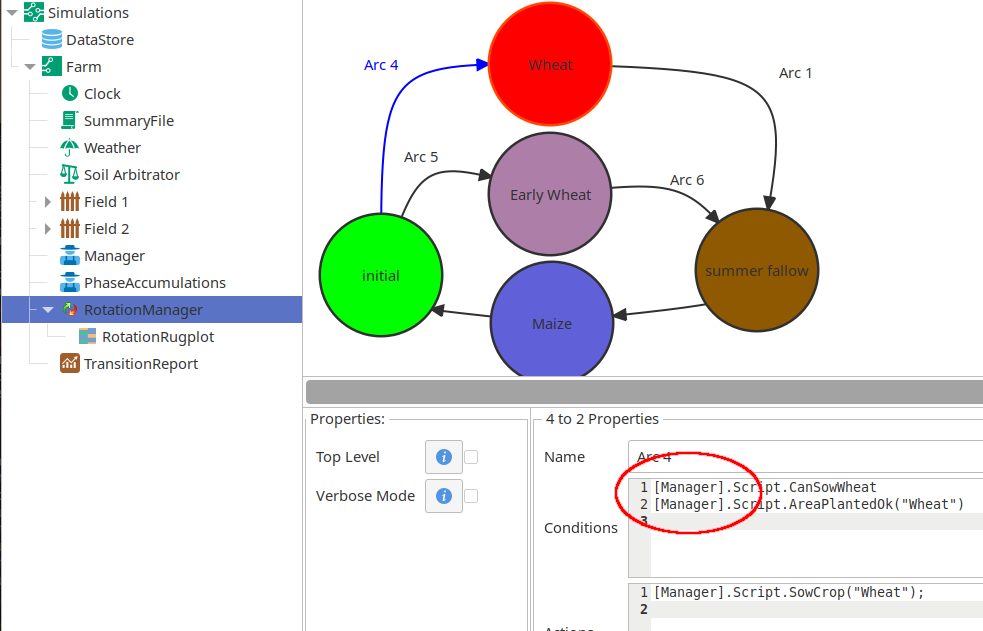
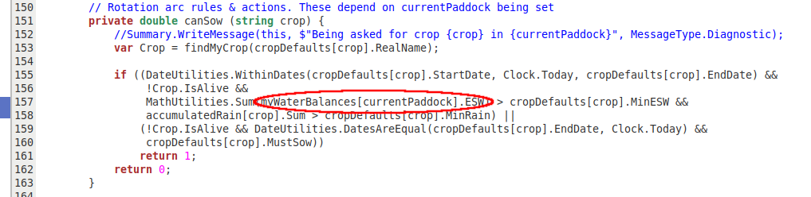
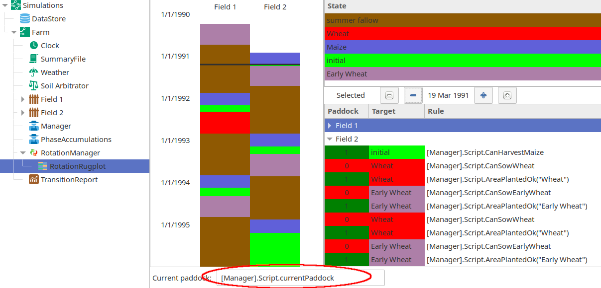

Multiple paddocks
=================

By default, the rotation manager component is configured as a "top level" management component that directs other management components by itself. In a multipaddock simulation, we want the component to track several paddocks, each with its own water balance, crops and residues - applying the same rotation to all. In addition, we'll introduce global (whole farm) rules that include measures such as the total area planted to each crop type, economic measures (eg. bank balance or expected crop prices) and farmer preferences - usually scenario related. Thus,  management is a combination of paddock scale rules (eg soil water above a threshold) and farm scale rules to apply when testing the desirability of actions in each paddock.

In `this test <https://github.com/APSIMInitiative/ApsimX/blob/master/Tests/Simulation/MultiZoneManagement/MultiPaddock.apsimx>`_ of a multipaddock simulation using the rotation manager, a top-level manager component directs the rotation manager, instead of the rotation manager being independant - the "top level" switch is turned off:

   A rotation manager configured as a slave to another manager component

Note their positioning at the top level (root) of the simulation, instead of within a paddock. As well, the rules (circled) are directed back to the top level manager, and are "paddock agnostic" - they make no reference to a paddock (which would be required should the rule be examining a water balance).

The replacement toplevel manager will examine each paddock for management actions by using its own variable ``currentPaddock``: the calling procedure follows "toplevel" to "rotation" to "toplevel" to some paddock specific variable. 

.. figure:: _static/multipaddock-toplevelmanager.png
   :alt: a toplevel manager
   :width: 100%

   A manager configured as a toplevel, directing a rotation manager sibling to evaluate each paddock.

The toplevel manager records the state of each paddock in an array (``currentState``), setting it before calling the ``DoManagement()``, and storing it back in the array afterwards.

It only remains to see that the paddock water balance can be called in a manner similar to a linked component. At the start of the simulation, each paddock's waterbalance component is stored in an array in the same way that ``[Link ...]`` provides in a conventional simulation. The sowing rule resolves which waterbalance is required through this array:

   A toplevel sowing rule, querying the current waterbalance for ESW.

The rugplot works similarly as before, yet needs an additional parameter defining the variable name used to set the current paddock under examination:

   A rugplot showing rule evaluations in the second paddock.

In summary, we've seen that the rotation manager is "turned off" in a multipaddock simulation, and instead directed (and supported) by another, more complex toplevel manager.

