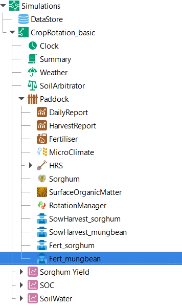
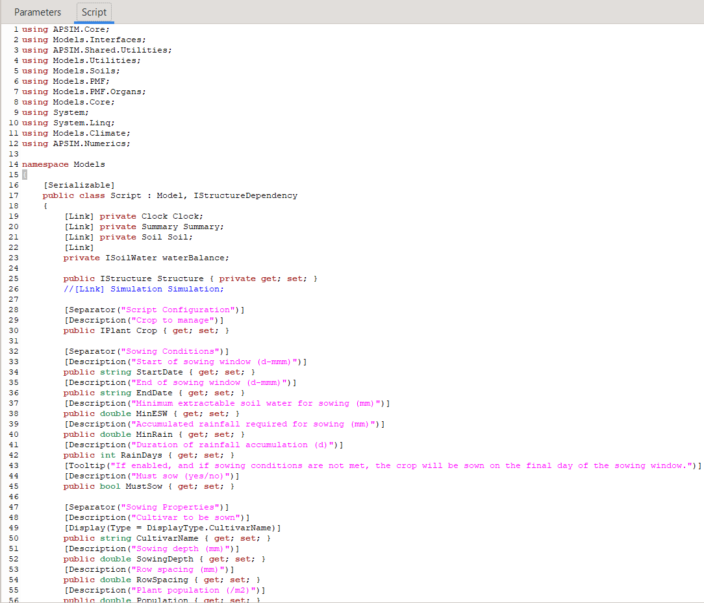
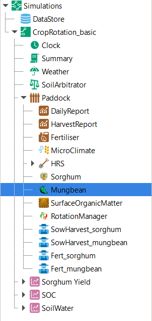
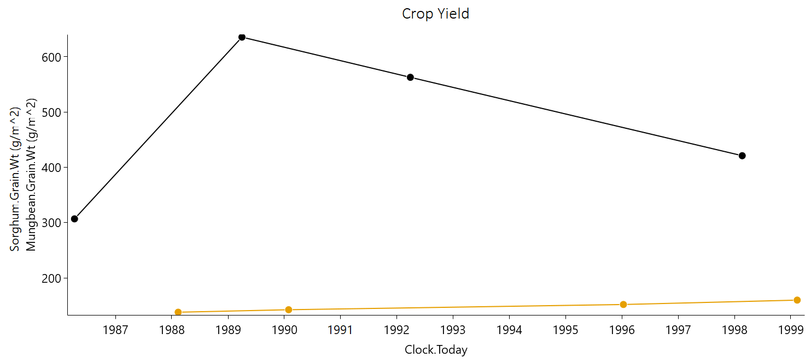

Basic Crop Rotations
========================================
When simulating crop production on a field over an extended period, 
the previous assumption of continuously cultivating a single crop with fixed management practices is rarely applicable. 
To represent predetermined crop rotations of multiple crops as well as highly flexible crop sequences, APSIM provides the ``RotationManager`` *model*. 
In the following, we will first have a look at the basic usage of the ``RotationManager``.
Subsequently, we will present various approaches for representing increasingly complex, user-specific crop rotation and sequencing scenarios.

Basic Overview of the Rotation Manager
----------------------------------------
In the following section, we will develop a simple crop rotation scenario in APSIM from the ground up.
As starting point, we will again utilise the earlier simulation of continuous Sorghum in Dalby: 
`Sorghum_continuous_carryOver.apsimx <Sorghum_continuous_carryOver/Sorghum_continuous_carryOver.apsimx>`_.
Please save the file under the new name *"CropRotation_basic.apsimx"* and also rename the simulation *node* from *"Continuous_Sorghum"* to *"CropRotation_basic"*.

To add the ``RotationManager`` *model* to the simulation tree, right-click on the ``Paddock`` *node*, click on ``Add model...``, 
expand the  ``Management`` folder, and double click on ``RotationManager`` 
(alternatively, you can drag-and-drop the ``RotationManager`` *model* onto the ``Paddock`` *node*).

.. figure:: _static/APSIMscreenshot_addingRotationManager.png
   :alt: Adding Rotation Manager
   :width: 100%

   Adding the Rotation Manager model to the simulation tree.

The ``RotationManager`` consists of a graphical bubble chart with which you can represent a crop rotation.
For our first example, we will aim at generating the crop rotation "Sorghum-Fallow-Mungbean-Fallow".
The crop rotation exclusively comprises summer crops and is rigidly predefined, 
without accommodating alternative crop choices in response to varying environmental conditions.
At the starting point, the ``RotationManager`` is blank.
To add your first crop, right-click on the blank canvas and select *"Add node"*.
Rename the *node* (i.e., bubble) to "Sorghum".
In the right-hand bottom corner, you may also add a further description (optional) and change the *node* colour.
For example, we selected a colour that is similar to the colour of sorghum heads. 
Please also select the tick boxes *"Top Level"* and *"Verbose Mode"*.
Subsequently, repeat these steps three further times to generate a total of four *nodes* for each field occupancy in the crop rotation.
Please drag the *nodes* on the canvas into the order of the intended rotatation "Sorghum-Fallow-Mungbean-Fallow".
Further, do not name several *nodes* identically (e.g., avoid that two *nodes* are called "Fallow") as this would prevent us from uniquely identifying to which *node* we are referring to later.
To easily distinguish between the two fallows, we name them *"Fallow_postSG"* for the fallow following sorghum, and *"Fallow_postMB"* for the fallow following mungbean.
Your bubble chart should now look similar to one of the below figures.
There are many ways how you can graphically organise the bubble chart.
Two common ways are to structure it as row sequence or circle.

   Bubble chart of a simple crop rotation - organised as row sequence.

   Bubble chart of a simple crop rotation - organised as circle.

While the *nodes* represent the different possible options of field occupancy, the next step is to connect the *nodes* with arcs.
Arcs define the transitions that we request APSIM to simulate.
Please add a single arc each for the desired transitions of our rotation plan "Sorghum-Fallow-Mungbean-Fallow".
For this, right-click on a *node* and select ``Add arc``, drag the arc to the *node* it shall transition to,
and click on the *node* to lock-in the arc.
Optionally, you can rename the arcs to more descriptive labels.
For example, below we chose the labels "Enter Sorghum", "Exit Sorghum", "Enter Mungbean", "Exit Mungbean".
The resulting bubble chart should look similar to the following:

   Addition of arcs to bubble chart.

The above bubble chart gives us the basic crop rotation structure that we will work with for this example.
It exactly identifies in which sequence crops and fallows will be simulated.
When clicking on any of the arcs, you will see that these transition rules require two arguments:

- **Conditions** that specify under which circumstances the simulation will transition from the starting node of the arc to the ending node of the arc.
- **Actions** that specify which activities are carried out as part of the transition.

At this stage, we did not yet specify any conditions and actions, which is the focus of the next subsection.
Another aspect we have not yet defined is the initial state of our rotation at the start of the simulation.
For this, please navigate with your cursor to the *"Properties"* box on the bottom of the ``RotationManager``.
In the drop-down menu ``Initial State``, please select *"Fallow_postMB"* as the state in which we start the simulation.
 

Transitioning between Plot States
----------------------------------------
To have a clean starting point for the definition of crop management rules, 
please first delete the current ``Manager folder`` from the simulation tree (under the ``Paddock`` *node*).
Let us now utilise one of the principles we mentioned earlier:
Instead of writing **C# code** from scratch, 
we can use scripts from both the *Management toolbox* as well as example *APSIMX files* that are distributed with the software as our starting point.
For this, navigate to ``Home`` > ``Open an example`` and open the example file *"Rotation.apsimx"*.
This is an example crop rotation file that is distributed with APSIM and that you may want to explore at your own time in more detail.
Here, we will copy a useful script that manages crop sowing and harvesting and use it within our simulation.
To copy the script, expand the simulation tree and navigate to ``Crop Pasture`` > ``Field``, copy the ``OatsManager``, 
and paste it into the ``Paddock`` *node* of our simulation *"CropRotation_basic"*.
As we will need two of these *manager* scripts, paste it a second time into the ``Paddock`` *node*.
Rename the manger *nodes* to ``SowHarvest_sorghum`` and ``SowHarvest_mungbean``.

For fertilisation, we can instead continue to use our previous *manager* script.
Please copy the ``Fertilise at sowing`` script, so that we again have two versions of it.
Rename the *managers* to ``Fert_sorghum`` and ``Fert_mungbean``.
You can keep the *manager* ``Fert_sorghum`` entirely unchanged,
while you should reduce the amount of fertiliser applied on mungbean to 15 kg/ha of nitrogen.
The resulting simulation tree should now look similar to the following:

   Simulation tree with updated *manager* scripts.

Copying existing manger scripts saved us a lot of coding work.
While this gives us the correct structure of crop management actions that we want to conduct, 
we still need to ensure that all parameter values are set as intended.
For this, we will step through each *manager* script and modify all necessary parameter values.

Let us start with ``SowHarvest_sorghum``:

- Set *"Crop to manage"* to *"Sorghum"* by selecting it from the drop down list.
- As we copied the crop *manager* from a winter crop (oats), the sowing window is unreasonable. Update its start and end date to the values we previously used for Sorghum in Dalby (start: 1-nov; end: 10-jan).
- For the required soil moisture and rainfall conditions, we also insert the values from our previous sorghum simulation in Dalby (Min. ESW: 120mm; Acc. Rain: 50mm; Rain duration: 7 days).
- Ensure that the *"Must sow?"* tickbox is unticked. If ticked, the script enforces that a crop is sown at the end of the sowing window, even if sowing conditions are not satisfied.
- Update the sowing properties to mirror the earlier parameters used for simulating sorghum in Dalby (Cultivar: Buster; Sowing depth: 30mm; Row spacing: 750mm; Plant population: 10 plants/m2).

(Please note: The above specified parameters of soil moisture and rainfall thresholds are quite a bit higher 
than what most agronomists would recommend for sorghum sowing in Dalby. 
However, for this tutorial, it is more instructive and illustrative to specify thresholds that are not satisfied in at least some of the recorded seasons, 
so that we can observe the consequences of not being able to sow a crop in certain years.)

Simple Modifications of C# Scripts
^^^^^^^^^^^^^^^^^^^^^^^^^^^^^^^^^^^^^^^^
When you inspect once more the earlier *manager* script from the continuous sorghum simulation (*Sorghum_continuous_carryOver.apsimx*),
you will see that there were some more sorghum-specific parameters in the *manager* script.
These were *"skip row configuration"*, *"tillering method"*, and *"fertile tiller number"*.
However, these sorghum-specific parameters are not included in the more generic *manager* script that we are using here.
This provides us with a good opportunity to explore another core capability required to flexibly generate APSIM simulations: 
modifying the **C# code** of *manager* scripts.

Let us first explore the background **C# code** that is generating the *manager* user interface which we have been modifying.
For this, select ``SowHarvest_sorghum`` in the simulation tree, and then click on the ``Script`` tab.

   Partial screenshot of the APSIM management script *"SowHarvest_sorghum"* written in C# (prior to any changes).

The above displays the first parts of the **C# code** in the ``SowHarvest_sorghum`` *manager* script that you can fully scroll through on your own screen.
If you have little past exposure or own experience with programming languages, the **C# code** may not mean much to you — and that is perfectly fine.
It is important to note, that a whole lot of APSIM modelling can be achieved without modifying any **C# code**.
What we are exploring here is to make light modifications to existing code which does not require a thorough understanding of *C#* nor an advanced knowledge of the code base of APSIM.
Even if you never plan to conduct such code modifications yourself, this section provides you with a high level understanding of the programmatic functioning of the APSIM user interface, which will be useful by itself.

For those interested, let us have a brief conceptual overview of the ``SowHarvest_sorghum`` *manager* script (otherwise, feel free to skip this paragraph).
This *C#* script is a custom APSIM management script inside the *Models* namespace - a logical grouping of related classes. 
The *using* statements at the top reference APSIM and .NET namespaces, 
allowing the script to access components such as soils, weather, plants, and utility functions without needing to specify their full namespace paths.
The *Script* class itself inherits from APSIM’s base *Model* class and implements the *IStructureDependency* interface. 
Inside the class, linked components (e.g., *Clock*, *Soil*, *Crop*) are automatically connected to other simulation modules. 
The script subscribes to simulation events like *StartOfSimulation* or *DoManagement*, 
and defines methods and properties that determine when to sow or harvest a crop. 
Overall, the code provides a structured way to embed dynamic crop management logic directly into an APSIM simulation.

What we want to do now is to modify the above script so that it is able to accept values 
for the sorghum-specific parameters *"skip row configuration"*, *"tillering method"*, and *"fertile tiller number"*.
Thereby, these variables need to be specified in a way that is interpretable by APSIM (i.e, corresponding to predefined classes in APSIM).
This can be achieved by consulting the `APSIM documentation for sorghum <https://docs.apsim.info/validation/Sorghum>`_ as well as the publicly available `APSIM Source Code <https://github.com/APSIMInitiative/ApsimX>`_ of the sorghum crop model.
Instead, let us here first learn another shortcut that does not require much understanding of **C# code**:
Selecting a suitable existing *manager* script, and copying the relevant **C# code** into our target *manager* script.

In the previously utilised *manager* script from the continuous sorghum simulation (*Sorghum_continuous_carryOver.apsimx*),
we know that the three sorghum-specific variables are defined in a correct manner.
In the user interface, when clicking on the *manager* script ``SowingRule``  we can easily see the three variables being referred to as follows:

When we then navigate to the ``Script`` tab, we can search for the same keywords and find the corresponding **C# code**.
Specifically, we are after the highlighted segments below:

Let us copy the highlighted code and paste it into the *manager* script ``SowHarvest_sorghum``, specifically after the code segment:

.. code-block:: csharp
    :caption: C# code section in the manager script *"SowHarvest_sorghum"*, after which sorghum-specific code should be added

    public double Population { get; set; }

With the above modifications, we defined the sorghum-specific variables in the ``Script`` tab 
and visualise them in the ``Parameters`` tab, making their values simple to adjust.
However, so far, we do not yet do anything with the newly defined variables and 
they thus have no effect on the simulation.
To ensure their utilisation, we have to include them as arguments in the ``SowCrop()`` method.
Specifically, we have to add the arguments ``rowConfig``, ``tillering``, and ``ftn`` within the call of ``Crop.Sow()``:

.. code-block:: csharp
    :caption: Addition of three sorghum-specific arguments in the call of **Crop.Sow()**

    public double Population { get; set; }
   Crop.Sow(
       population: Population, 
       cultivar: CultivarName, 
       depth: SowingDepth, 
       rowSpacing: RowSpacing, 
       rowConfig: (double)RowConfiguration, 
       tillering: (int)TilleringMethod, 
       ftn:Ftn
       );

Now, when APSIM conducts the sowing of a sorghum crop,
it takes into consideration the specific parameters for row configuration and tillering.
The updated **C# code** should look like the following.
The code additions can be found in lines 58-73.
The remainder of the code remained unchanged from the template that we used.

.. code-block:: csharp
   :caption: APSIM management script *"SowHarvest_sorghum"* with sorghum-specific additions
   :linenos:

   using APSIM.Core;
   using Models.Interfaces;
   using APSIM.Shared.Utilities;
   using Models.Utilities;
   using Models.Soils;
   using Models.PMF;
   using Models.PMF.Organs;
   using Models.Core;
   using System;
   using System.Linq;
   using Models.Climate;
   using APSIM.Numerics;
   
   namespace Models
   {
       [Serializable]
       public class Script : Model, IStructureDependency
       {
           [Link] private Clock Clock;
           [Link] private Summary Summary;
           [Link] private Soil Soil;
           [Link] private ISoilWater waterBalance;
           
           public IStructure Structure { private get; set; }
           //[Link] Simulation Simulation;
   
           [Separator("Script Configuration")]
           [Description("Crop to manage")]
           public IPlant Crop { get; set; }
   
           [Separator("Sowing Conditions")]
           [Description("Start of sowing window (d-mmm)")]
           public string StartDate { get; set; }
           [Description("End of sowing window (d-mmm)")]
           public string EndDate { get; set; }
           [Description("Minimum extractable soil water for sowing (mm)")]
           public double MinESW { get; set; }
           [Description("Accumulated rainfall required for sowing (mm)")]
           public double MinRain { get; set; }
           [Description("Duration of rainfall accumulation (d)")]
           public int RainDays { get; set; }
           [Tooltip("If enabled, and if sowing conditions are not met, the crop will be sown on the final day of the sowing window.")]
           [Description("Must sow (yes/no)")]
           public bool MustSow { get; set; }
   
           [Separator("Sowing Properties")]
           [Description("Cultivar to be sown")]
           [Display(Type = DisplayType.CultivarName)]
           public string CultivarName { get; set; }
           [Description("Sowing depth (mm)")]
           public double SowingDepth { get; set; }
           [Description("Row spacing (mm)")]
           public double RowSpacing { get; set; }
           [Description("Plant population (/m2)")]
           public double Population { get; set; }
   
           [Description("Enter skip row configuration : ")]
           public RowConfigurationType RowConfiguration { get; set; }
           [Description("Tillering Method")]
           public TilleringMethodType TilleringMethod { get; set; } = 0;
           [Description("Enter Fertile Tiller No. : ")]
           public double Ftn { get; set; }
           public enum TilleringMethodType 
           {
               RuleOfThumb = -1,
               FixedTillering = 0,
               DynamicTillering = 1
           }
           public enum RowConfigurationType 
           {
               Solid, SingleSkip, DoubleSkip
           }
   
           public Accumulator accumulatedRain { get; private set; }
           private bool afterInit = false;
                   
           [EventSubscribe("StartOfSimulation")]
           private void OnSimulationCommencing(object sender, EventArgs e)
           {
               if (Crop == null)
                   throw new Exception("Crop must not be null in rotations");
               accumulatedRain = new Accumulator(this, "[Weather].Rain", RainDays);
               Summary.WriteMessage(this, this.FullPath + " - Commence, crop=" + (Crop as Model).Name, MessageType.Diagnostic);
               afterInit = true;
               MonthlyHarvestedWt = 0;
           }
           
           [EventSubscribe("DoManagement")]
           private void DoManagement(object sender, EventArgs e)
           {
               accumulatedRain.Update();
           }
   
           // Test whether we can sow a crop today
           // +ve number - yes
           // 0          - no
           // -ve number - no, out of scope (planting window)
           [Units("0-1")]
           public int CanSow
           {
               get
               {
                   if (!afterInit)
                       return 0;
                   bool isPossibleToday = false;
                   bool inWindow = DateUtilities.WithinDates(StartDate, Clock.Today, EndDate);
                   bool endOfWindow = DateUtilities.DatesEqual(EndDate, Clock.Today);
                   if (!Crop.IsAlive && inWindow && accumulatedRain.Sum > MinRain && MathUtilities.Sum(waterBalance.ESW) > MinESW)
                       isPossibleToday = true;
   
                   if (isPossibleToday)
                       return 1;
            
                   if (!Crop.IsAlive && endOfWindow && MustSow)
                       return 1;
   
                   if (!Crop.IsAlive && !inWindow)
                       return -1;
                   return 0;
               }
           }
   
           public void SowCrop()
           {
               Summary.WriteMessage(this, this.FullPath + " -  sowing " + (Crop as Model).Name, MessageType.Diagnostic);
               Crop.Sow(
                   population: Population, 
                   cultivar: CultivarName, 
                   depth: SowingDepth, 
                   rowSpacing: RowSpacing, 
                   rowConfig: (double)RowConfiguration, 
                   tillering:(int)TilleringMethod, 
                   ftn:Ftn
                   );
           }
   
           [Units("0-1")] 
           public int CanHarvest
           {
               get
               {
                   if (!afterInit)
                       return (0);
                   //Summary.WriteMessage(this, "canLeave:" + Crop.IsReadyForHarvesting, MessageType.Diagnostic);
                   return Crop.IsReadyForHarvesting ? 1 : 0;
               }
           }
   
           public void HarvestCrop()
           {
               Summary.WriteMessage(this, this.FullPath + " -  harvesting " + (Crop as Model).Name, MessageType.Diagnostic);
               MonthlyHarvestedWt = (  Structure.FindChild<IModel>("Grain", relativeTo: (INodeModel)Crop) as ReproductiveOrgan).Wt;
               Crop.Harvest();
               Crop.EndCrop();
           }
           
           public double MonthlyHarvestedWt {get; set;}
           [EventSubscribe("StartOfMonth")]
           private void DoStartOfMonth(object sender, EventArgs e)
           {
               MonthlyHarvestedWt = 0;
           }
       }
   }

In the thus modified *manager* script ``SowHarvest_sorghum`` we can switch back from the ``Script`` tab to the ``Parameters`` tab.
Now, we should be able to modify the three target parameters *"skip row configuration"*, *"tillering method"*, and *"fertile tiller number"* to their desired values:
solid row configuration, fixed tillering method, and zero fertile tillers.

The above provided an example of a work routing that implements minor changes to a *manager* script, without thorough knowledge or skills in *C#* programming.
If you are interested in gaining a more mechanistic understanding of how to flexibly modify **C# code** in APSIM, the tutorials
`"Build a model" <https://apsimnextgeneration.netlify.app/development/tutorial/buildmodeltutorial/>`_ and
`"How PMF functions work" <https://apsimnextgeneration.netlify.app/development/tutorial/howpmffunctionswork/>`_
are valuable resources.
You may also want to consult generic training material and tutorials on *C#*.

Updating the Remaining Manager Scripts
^^^^^^^^^^^^^^^^^^^^^^^^^^^^^^^^^^^^^^^^
With the *manager* script ``SowHarvest_sorghum`` being finalised, we still need to update the remaining three *manager* scripts.
The remaining updates are much simpler.
Let us continue with ``SowHarvest_mungbean``.
When clicking on the drop-down list for *"Crop to manage"*, we see that the only choice is sorghum, while mungbean is not available.
In fact, when you look at the simulation tree, you see that ``Sorghum`` is the only crop model that we have included in our simulation.
To add the mungbean crop model, right-click on the ``Paddock`` *node*, select ``Add model...``, 
expand the ``PMF`` folder (for: Plant Modelling Framework; `Brown et al., 2014`_), and double-click on the ``Mungbean`` crop model 
(or alternatively drag-and-drop the ``Mungbean`` crop model onto the simulation tree under ``Paddock``).
The resulting simulation tree should now look similar to the following:

   Simulation tree with added *Mungbean* crop model.

When you now navigate again to the *manager* script ``SowHarvest_mungbean``, you are able to select *Mungbean* from the drop-down list as the target crop.
Further modifications that we need to conduct to ``SowHarvest_mungbean`` are:

- Update the sowing window start and end dates to desired values for mungbean around Dalby (start: 1-oct; end: 30-dec).
- Update the soil moisture and rainfall conditions required for sowing (Min. ESW: 120mm; Acc. Rain: 50mm; Rain duration: 7 days).
- Again ensure that the *"Must sow?"* tickbox is unticked.
- Select a set of desired sowing properties for mungbean around Dalby (Cultivar: CeleraII; Sowing depth: 40mm; Row spacing: 500mm; Plant population: 25 plants/m2).

The final *manager* script ``SowHarvest_mungbean`` should look similar to the following:

   Updated parameter values for mungbean sowing and harvesting.

Next, we select the *manager* script ``Fert_sorghum``.
Here, we can see that all values are already as we intend them to be and no further changes are needed.
Instead, when selecting  ``Fert_mungbean``, we see that the target crop is still blank and we have to select *Mungbean* from the drop-down list.
Now, all manager scripts have been finalised.

Specifying Transition Rules
^^^^^^^^^^^^^^^^^^^^^^^^^^^^^^^^^^^^^^^^
Let us now return to the ``RotationManager`` *node* and see if we can advance the question of how to transition between the various plot states.
After selecting the arc *"Enter Sorghum"*, we see that the **"Conditions"** and **"Actions"** fields in the bottom right-hand corner are still blank.
As we remember, we defined a set of conditions for when we want a crop to be sown in the *manager* scripts ``SowHarvest_sorghum`` and ``SowHarvest_mungbean``.
Here, we want to link to those *manager* scripts to let them impose their conditions for sowing.
For this, we click into the **"Conditions"** box and add a reference to the *manager* script by typing ``[SowHarvest_sorghum]``.
When you add a dot (.) after this reference, IntelliSense displays a drop-down list of available properties and methods.
Here, we are interested to access the ``Script`` property, that we have modified earlier ourselves.
After adding another dot (.) we can then access the sowing condition that we defined in the **C# code** that was called ``CanSow``.

Next, we want to specify the **"Actions"** that shall be conducted if this condition is fulfilled.
For this we equivalently click into the **"Conditions"** box, again add the reference to the *manager* script by typing ``[SowHarvest_sorghum]``,
append a dot (.) and the ``Script`` property, append another dot (.) and select the action ``SowCrop()``.

The completed box of **"Conditions"** and **"Actions"** should look like the following:

   Transition rules for the arc *"Enter Sorghum"*.

In a similar fashion, we have to step through all remaining three transition rules. 
For this, please click on each arc and select the suitable conditions and actions by using IntelliSense.
Once you have completed this task, you can compare your choices to the correct **C# code** below.

.. code-block:: csharp
    :caption: List of transition rules of the RotationManager

    //// Arc: Enter Sorghum
    // Conditions
    [SowHarvest_sorghum].Script.CanSow
    // Actions
    [SowHarvest_sorghum].Script.SowCrop()

    //// Arc: Exit Sorghum
    // Conditions
    [SowHarvest_sorghum].Script.CanHarvest
    // Actions
    [SowHarvest_sorghum].Script.HarvestCrop()

    //// Arc: Enter Mungbean
    // Conditions
    [SowHarvest_mungbean].Script.CanSow
    // Actions
    [SowHarvest_mungbean].Script.SowCrop()

    //// Arc: Exit Mungbean
    // Conditions
    [SowHarvest_mungbean].Script.CanHarvest
    // Actions
    [SowHarvest_mungbean].Script.HarvestCrop()

With this, we have completed the setup of a basic ``RotationManager`` *model* in APSIM.

Crop-Soil Interactions
----------------------------------------
Each crop type comes with its own abilities and constraints in accessing water.
As we started out with an example *APSIMX file* that only focussed on Sorghum, we currently only have specifications for the Plant Available Water Capacity (PAWC) of Sorghum.
To inspect the specific values, please expand the *Soil node* ``HRS``, then expand the ``Physical`` *node*, and select ``SorghumSoil``.

   Crop-soil interaction parameters for sorghum.

Here, you can see the specific values for: 

- Crop-specific soil water extraction limit (*Lower Limit*; LL). You may also know this variable under the terms *Crop Lower Limit*. Below the indicated values, the crop cannot extract water (even though some water is still physically present in the soil profile). Please note that this is different from *Lower Limit 15* (LL15), also known as *Wilting Point*, which indicates the soil water content at 15 bar suction (which is exclusively soil-specific, but not crop-specific).
- Water Extraction Coefficient (KL). The KL factor specifies the maximum fraction of available water (above LL15) that a plant’s roots can extract from a soil layer per day under non-limiting conditions. It reflects both root and soil properties (e.g., root density, soil hydraulic conductivity, etc.).
- Root Exploration Factor (XF). The XF factor limits root penetration in a soil layer, describing the fraction of the layer accessible to roots. When XF equals 1, roots can fully explore the layer, whereas when XF equals 0, root growth into that layer is entirely restricted. Values in between reflect partial restriction (e.g., due to physical or chemical constraints).

Please note that the general soil physical properties (such as LL15) can be seen and modified under the parent *node* ``Physical``.
Since we introduced mungbean into this simulation, we have to generate a similar ``MungbeanSoil`` *node*.
For this, let us copy ``SorghumSoil`` and rename the copy to ``MungbeanSoil``.
Values of crop-soil interactions are usually experimentally determined and should not be specified out of thin air.
However, as we are aiming here at demonstrating the technical handling of APSIM, we only introduce some examplary and arbitrary changes to these parameter values for the sake of illustration.
Here, we assume that mungbean would be characterised by higher LL values, since mungbean has a shallower root system than sorghum's deep, fibrous roots.
We also assume that KL values for mungbean are lower than for sorghum, meaning that the extraction rate of mungbean roots is lower and ceases in the deepest segments of the soil profile.
As a major reference for improving your understanding of crop-soil interactions in APSIM, and for guidance on how to calculate the various paremeter values,
please consult `Dalgliesh et al. (2016)`_.
Please manually update the *LL* and *KL* values in ``MungbeanSoil`` to the following:

   Updated crop-soil interaction parameters for mungbean.

Performing the Simulation and Recording Results
----------------------------------------
With the overall structure of the simulation being finalised, we can now update the results variables that we want to be recorded, perform the simulation, and visualise results.

Recording Results
^^^^^^^^^^^^^^^^^^^^^^^^^^^^^^^^^^^^^^^^
At present, the simulation records those variables specified in the *Report nodes* ``DailyReport`` and ``HarvestReport``.
To update result variables for our current case, copy the ``HarvestReport`` and rename the two *Report nodes* to ``HarvestReport_sorghum`` and ``HarvestReport_mungbean``.
You can leave ``HarvestReport_sorghum`` as is.
Instead, please replace all references to *"[Sorghum]"* in ``HarvestReport_mungbean`` to *"[Mungbean]"*.
Thereby, make sure to update both the *"Report variables"* (top) as well as the *"Report events"* (bottom).
The updated *Report nodes* should look similar to the following:

   Updated report node *"HarvestReport_mungbean"*.

It is important to note that APSIM is very flexible in defining very different *Report nodes*.
The here shown option just provides one example.
When you utilise APSIM for a very specific research objective, it is advisable to specify *Report nodes* that are most suitable to answering your research question.
For further detailed information on how to utilise *Report nodes*, and particularly how to use the ``Transition Report``, 
please consult the section: :doc:`What to Do When It Doesn't Work </Diagnosis>`.

Adding a Rugplot
^^^^^^^^^^^^^^^^^^^^^^^^^^^^^^^^^^^^^^^^
In addition to such standard result recording, 
the ``RotationManager`` offers the ``RotationRugplot`` interface for visually tracking simulation progression over time.
To enable it, right-click on ``RotationManager``, click on ``Add model...``, expand the *Management* folder, 
and double-click on ``RotationRugplot`` (alternatively, you can drag-and-drop the ``RotationRugplot`` onto the ``RotationManager`` *node*).

Performing the Simulation
^^^^^^^^^^^^^^^^^^^^^^^^^^^^^^^^^^^^^^^^
All aspects of the simulation have now been specified.
In the top menu bar of APSIM, you can now select ``Save`` and then ``Run`` to perform the simulation.
This should lead to a progress bar being visualised and subsequently a message indicating that the simulation has successfully been completed.
If instead an error message appears, carefully examine its details, and identify where your file differs from the data entry shown in this tutorial.

Visualising Results
^^^^^^^^^^^^^^^^^^^^^^^^^^^^^^^^^^^^^^^^
The only remaining step is to adjust the results figures to our current analysis.
It is good to remember that the visualisation tools in APSIM are provided primarily for convenience. 
They are particularly useful for checking whether the simulation is functioning as intended and for identifying if any corrections and modifications are necessary.
Instead, when interested at generating outputs for external use (journal publications, reports, etc.), users can also generate figures by loading numeric APSIM results into their preferred tool for data visualisation (such as R, Python, Excel, Power BI).
Select the *node* ``Sorghum Yield`` and rename it to ``Crop Yield``.
Expand the *node*, generate a copy of ``Series``, and rename the two items to ``Yield_sorghum`` and ``Yield_mungbean``.
Select ``Yield_sorghum`` and change the drop-down value for *"Data Source"* to ``HarvestReport_sorghum``.
Change the drop-down value for *"Colour"* to *"Vary by Graph series"*.
Equivalenty, select ``Yield_mungbean`` and change the drop-down value for *"Data Source"* to ``HarvestReport_mungbean``.
Further, change the drop-down value for *"Y"* to *"Mungbean.Grain.Wt"*.
The resulting figure for ``Crop Yield`` should look similar to the following:

   Sorghum (black) and mungbean (yellow) crop yield over time.

Results Interpretation
----------------------------------------
As first step of interpreting results, we will inspect the Rugplot.
The Rugplot visualises the progression of crops and fallows that occupy the simulated field.
Specifically, the bar on the left-hand side shows the field occupancy from the start of the simulation (top) towards the end (bottom).
We can see that the simulation starts out with a fallow, as we had specified.
We then see that the field occupancy changes sequentially as Sorghum-Fallow-Mungbean-Fallow.
This allows us to confirm that the simulation is progressing according to the intended crop sequence and that no errors require correction.
Another key insight from the Rugplot is that fallow periods vary in length.
This means, that the specified sowing condition is not met in various seasons and no crop is sown.

.. figure:: _static/APSIMscreenshot_CropRotationRugplot.png
   :alt: CropRotationRugplot
   :width: 80%

   Rugplot showing the progression of field occupancy over time.

Besides this first overview of field occupancy, the Rugplot displays on the right-hand side for each date:

- The transition rule that is checked for (e.g., can sorghum be sown)
- The results value of the transition rule (e.g., -1)

For example, in the here displayed Rugplot, we see that on the 8th Jan 1985, towards the beginning of the simulation,
the field *state* is a fallow, the transition rule that is checked for is if sorghum can be sown, and the result value of the transition rule is -1.
As defined by the **C# code** in the manager script ``SowHarvest_sorghum``, the value -1 is returned if the conditions for sowing a crop are not fulfilled.

As you can see, the Rugplot is very efficient at providing a big-picture overview of the progression of the simulation.
If we instead want to inspect a table of major simulation dates, it is more useful to directly navigate to the *Report nodes*.
When first clicking on ``DailyReport``, you are provided with an extensive table where each row corresponds to daily outputs of the selected reporting variables.
This kind of numeric output is useful for being synthesised by the graphing tools in APSIM or as input to numeric analysis and visualisation within external software tools of your choice.
For direct inspection, variables reported in aggregate form, such as annual totals or averages, or those recorded upon specific events like sowing, flowering, or harvest, are more useful.
For example, the *Report nodes* ``HarvestReport_sorghum`` and ``HarvestReport_mungbean`` provide results of selected variables on the day of harvesting only.
To inspect these values in a tabular format, click on the ``Data`` tab, after navigating to each respective *Report node*.
(For generating a *Report node* that displays each state transition, see: :doc:`What to Do When It Doesn't Work </Diagnosis>`)

   Table of selected results variables on the harvest day of sorghum.

   Table of selected results variables on the harvest day of mungbean.

In the report tables, you can easily identify all years in which no crop was harvested (1987, 1991, 1993, 1994, 1995, 1997), 
with the three-year period from 1993 to 1995 representing the longest consecutive duration without harvest.

The equivalent figure of the annual progression in yield is provided by the ``Crop Yield`` graph which we generated and displayed earlier.
The figure shows that sorghum yields are highly variable, with the lowest yield being only about half of the highest yield.
The four mungbean yields instead show still substantial though slightly less variability.
Such observed patterns can be typical entry points for further investigations into the likely causes of simulation results, 
although they may also be driven purely by year-to-year climate variability.

The other graphs ``SOC`` and ``SoilWater`` show that the field observes a strong downward trend in soil organic carbon.
We could investigate if this is driven by the low field occupancy as well as by crop residue management practices.
Further, there is a strong interannual fluctuation of volumetric soil water without any strongly apparent long-term trend.

This concludes the tutorial on defining and utilising the Rotation Manager for the simulation of a basic crop rotation.
The final *APSIMX file* produced in this tutorial can be accessed for comparison at: 
`CropRotation_basic.apsimx <CropRotation_basic/CropRotation_basic.apsimx>`_.
To reinforce your understanding of the main functions of the Rotation Manager
we suggest you to also read through the presentation of the Rotation Manager on the APSIM website:
`APSIM Rotation Manager <https://apsimnextgeneration.netlify.app/usage/rotationmanager/>`_.

References
----------------------------------------

.. _Brown et al., 2014:

Brown, H. E., Huth, N. I., Holzworth, D. P., Teixeira, E. I., Zyskowski, R. F., Hargreaves, J. N. G., & Moot, D. J. (2014). Plant Modelling Framework: Software for building and running crop models on the APSIM platform. Environmental Modelling & Software, 62, 385-398. https://doi.org/10.1016/j.envsoft.2014.09.005 

.. _Dalgliesh et al. (2016):

Dalgliesh, N. P., Hochman, Z., Huth, N., & Holzworth, D. (2016). A protocol for the development of soil parameter values for use in APSIM. CSIRO. https://www.apsim.info/wp-content/uploads/2019/10/Parameters-for-soil-water-Ver24.pdf

