Continuous Cropping of a Single Crop
=====
The most classical starting point in the learning and usage of crop models is the simulation of a single crop cycle, from sowing to harvest.
For instance, when crop models are used to simulate the observed crop growth from agricultural field trials, 
each trial treatment is represented by a single crop cycle simulation. 
This is the most common approach even when the experimental data come from continuous, multi-year trials on identical plots.
Crop model simulations of single crop cycles are typically used for crop model calibration and evaluation. 
Once calibrated, the crop model can be employed for more analytical purposes, 
such as assessing the impact of a shift in management practices or changing environmental conditions (e.g., climate change) 
on crop growth processes, crop yield, and further outcome indicators. 

This section introduces the simulation of continuous cropping. 
It builds upon the classical single crop cycle approach
by demonstrating how to simulate the continuous cropping of such a single crop across multiple, consecutive growing seasons.
Thereby, we primarily consider the case of simulating the continuous carry-over of soil water and nutrient states between subsequent crop cycles. 
For comparison, we also briefly consider the alternative case of resetting soil water and nutrient states at the beginning of each crop cycle.
A subsequent section of this tutorial will then focus on the continuous simulation of more complex crop rotation scenarios.

Simulation with State Carry-Over
-------------------------------------
Extending the simulation of a single crop cycle to the repeated, continuous growth of the same crop over multiple years can easily be achieved in APSIM.
It predominently entails:

- Extending the start and end dates of the simulation in the ``Clock`` node of the simulation tree to the desired multi-year period.
- Specifying rule-based management actions - such as for sowing, fertilisation, and irrigation - based on desired triggers, such as fixed dates, or more commonly, *state variable* thresholds.

For instance, consider the two example APSIM files ``Sorghum.apsimx`` and ``Wheat.apsimx`` included with the APSIM installation,
which you can access by selecting "Open an Example" from the top toolbar of the APSIM graphical user interface (GUI).

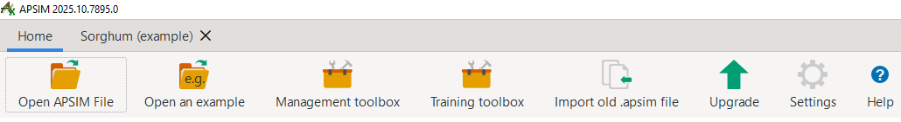

   Top toolbar from the APSIM GUI, showing the "Open an Example" button.

Instead of simulating the respective crop over a single season, both files simulate continuous crop growth over a period of 100 years, from 1900 to 2000.
You can explore both files and the simulation results by opening and running them in your own time.

To better understand the steps and details of continuous simulations of single crops, we will utilise a modified version of the file ``Sorghum.apsimx`` as a starting point.
It can be accessed here: `Sorghum_continuous_carryOver.apsimx <Sorghum_continuous_carryOver/Sorghum_continuous_carryOver.apsimx>`_.
For obtaining the best value from this guide, we suggest you to open the file in your local copy of the APSIM software and follow along for the remainder of the tutorial.

This example file simulates sorghum in Dalby (South-East Queensland, Australia). However, instead of simulating exclusively a single crop cycle, from sowing to harvest,
the simulation runs continuously from its **start date** on 1/01/1985 to its **end date** on 31/12/1999, covering a total of 15 years.
In the simulation tree structure shown on the left-hand side of the APSIM GUI, you can inspect these values by navigating to
the ``Clock`` node.

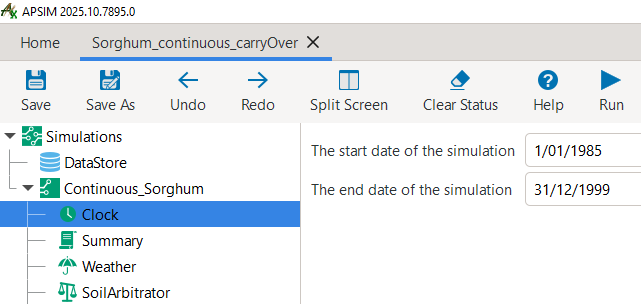

   Clock node from the APSIM GUI, showing the start and end dates of the simulation.

A core aspect of continuous simulations is to specify the timing of all core management actions.
The most simple option is the specification of fixed dates. 
This can be a suitable choice for thought experiments, such as the analysis of consistently planting early or late in the season.
However, the more common choice for continuous simulations is to define the timing of management actions based on *state variables* reaching certain thresholds or the occurance of specific events.
This could refer to a minimum level of soil water content, a cumulative rainfall threshold, a certain crop developmental stage being reached, or a time period elapsed since the last management action, among others.
Such ``SowingRules`` are specified via *manager scripts*. 
For our example, when clicking on the ``SowingRule`` node in the simulation tree, you can see that sorghum is sown if the following criteria are fulfilled:

- The date falls within the sowing window from 1st November to 10th January.
- Extractable soil water exceeds 120 mm.
- Cumulative rainfall exceeds 50 mm in the preceding 7-day period.

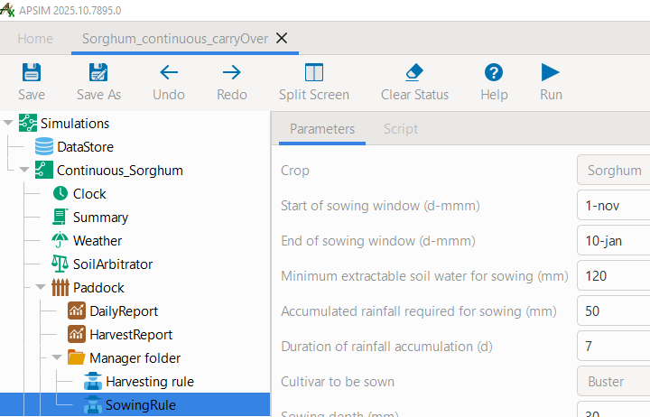

   The sowing rule manager script indicating the required conditions for sowing to be initiated by APSIM.

As always in APSIM, you can see that many pre-defined functions are available through predefined *manager scripts*.
You can see further alternative sowing rules by clicking on ``Home`` > ``Management toolbox`` > ``Plant``.

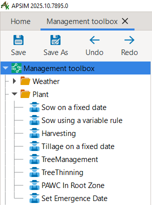

   Overview of predefined sowing rules in the **APSIM Management toolbox**.

While these predefined *manager scripts* provide many functionalities, APSIM transparently exposes the underlying **C# code** under the ``Script`` tab.
Instead of using predefined *manager scripts*, this allows users to write their own customised rules for management actions directly within the GUI.
For users who are not familiar with C#, the predefined *manager scripts* provide a useful starting point for modifying and extending rules as needed.

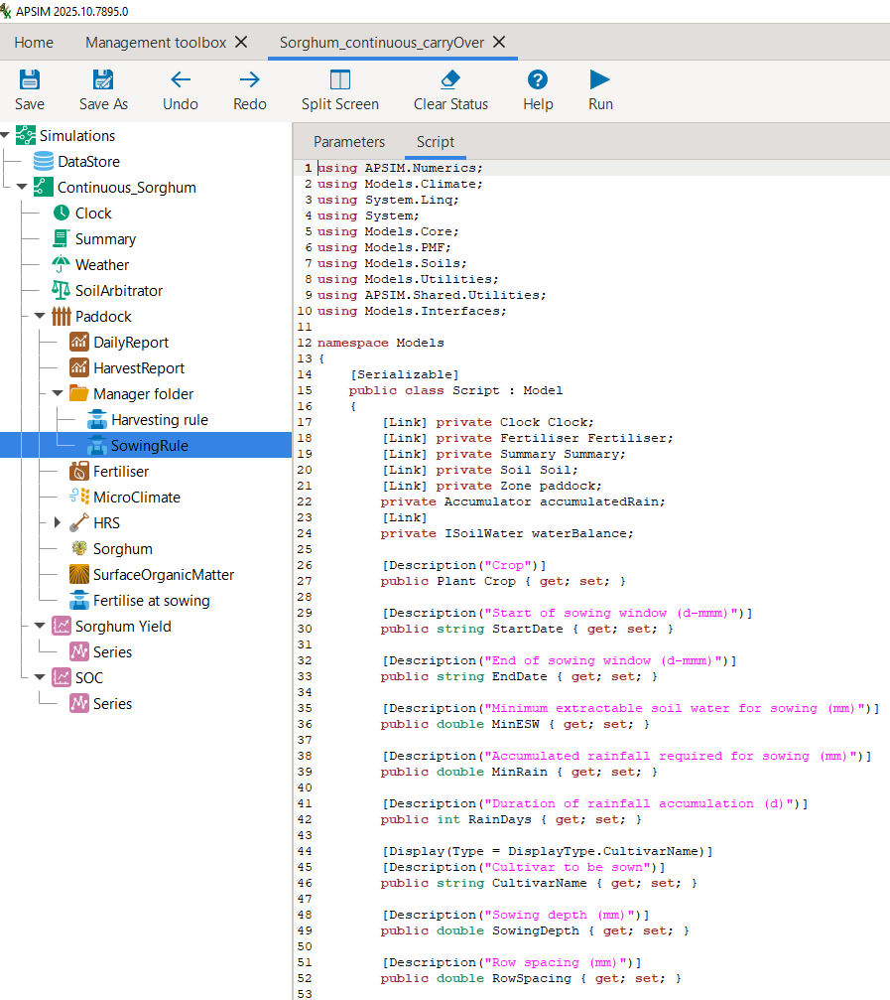

   The **C# code** of the sowing rule accessible via the **Script** tab.

Generally, when working with APSIM, it is useful to remember that the GUI is meant as an aid to conducting crop modelling with APSIM.
However, it is not obligatory to use the GUI for all tasks.
For users that prefer to utilise **Code Editors** (such as VS Code, Sublime Text, Vim, Emacs etc.), 
the simulation tree that is visualised by the APSIM GUI can also directly be edited via such code editors, 
as it is simply a representation of an underlying JSON file.
When you open the current example *APSIMX file* in a code editor, its first rows look like this:

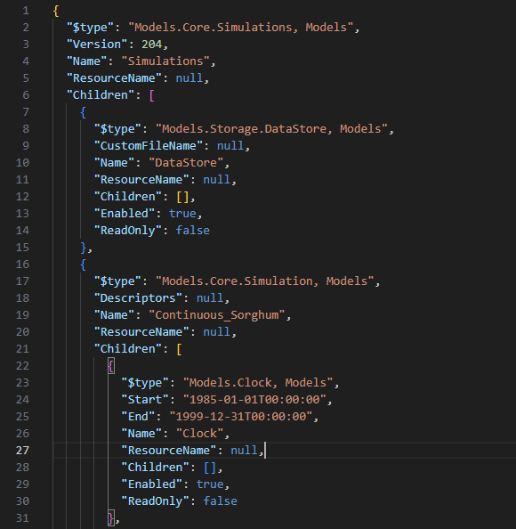

   **JSON file structure** of an **APSIMX file**.

Equivalently as for sowing, the timing of fertiliser application is also defined based on another variable.
Here, all fertiliser is applied at sowing. 
The predefined *manager script* ``Fertilise at sowing`` implements this.
However, we also could apply top-up fertiliser upon reaching a later crop development stage.

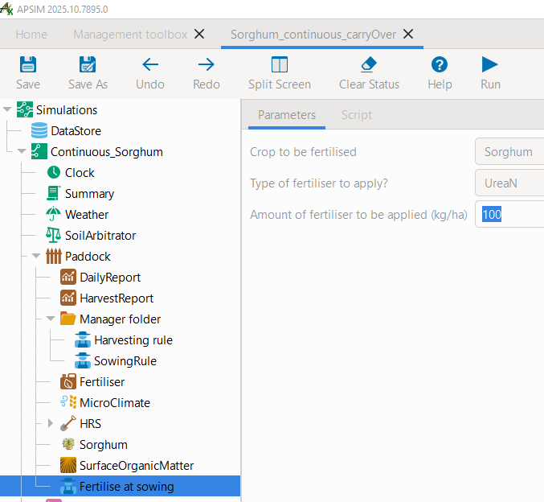

   The fertilisation *manager script*.

When conducting multi-year simulations, a range of outcome variables can be of interest.
As always, crop yield is a key variable.
In addition, also soil water and soil nutrient conditions may be highly relevant.
In this example, we included separate graphs for crop yield, soil volumetric water content, and soil organic carbon (each across the full soil profile).
To conveniently include the sum of certain *state variables* across the full soil profile in the simulation results,
we added the following code to our results variables in the *results node* ``DailyReport``:

.. code-block:: console

    # Total soil organic carbon across the soil profile
    Sum([Soil].Nutrient.Organic.C) as SoilOrganicC_fullProfile

    # Total volumetric water content across the soil profile
    Sum([Soil].Water.Volumetric) as SoilWatVolumetric_fullProfile

Please now run the simulation by clicking ``Save`` and then ``Run``.
You can now inspect the results by selecting the *graph node* ``Sorghum Yield``.
As you can seen, in only 9 of the 15 years a sorghum crop was harvested.
Accordingly, in the remaining years, either the sowing conditions were not satisfied (so that no crop was sown)
or the crop failed prior to producing any grain yield.
Further, the high level of yield variability can be noted, ranging from 2.9 t/ha to 8.8 t/ha.

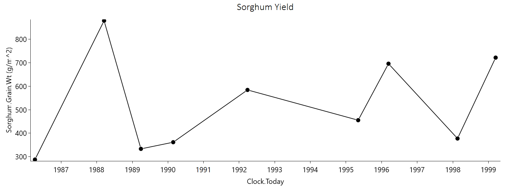

   Sorghum grain yield - continuous cropping with state carry-over.

Simulation without State Carry-Over
-------------------------------------
Let us now compare the above results with a simulation that resets major *state variables* after each crop cycle.
Specifically, soil water, soil nutrient, and surface organic matter pools will be reset every year.
For this purpose, prior to making changes, we first save the current file under the new name *Sorghum_continuous_carryOver_reset.apsimx*.
We then copy the entire simulation tree ``Continuous_Sorghum`` and paste it back into the root node ``Simulations``.
This gives us two identical child nodes. Let us rename the first to ``ContinuousSorghum_CarryOver`` and the second to ``ContinuousSorghum_Reset``.
From any of the two child nodes, please also copy all three *graph nodes* (``Sorghum Yield``, ``SOC``, ``SoilWater``) and paste them into the root node ``Simulations``. 
Expand each graph node and change the value of ``Colour`` to *Vary by SimulationName*.
The resulting JSON tree structure, should look similar to the below example:

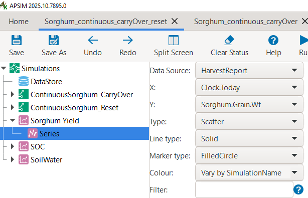

   Updated structure of the JSON simulation tree: Comparing state carry-over and resetting.

Now, navigate to ``Home`` > ``Management toolbox`` > ``Other`` in the APSIM GUI, 
copy the manager ``Reset on date`` and paste it into the ``Paddock`` node of the simulation ``ContinuousSorghum_Reset``.
An alterantive manager to ``Reset on date`` could have been the option ``Reset on sowing``.
Select the ``Reset on date`` manager, set the date to **1-May** and ensure that all three *state variables* (water, soil nutrients, surface organic matter) are reset.

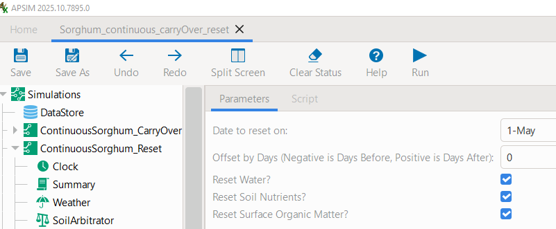

   Manager script for annual resetting of *state variables*: water, soil nutrients, and surface organic matter.

By now, your *APSIMX file* should look like the following: `Sorghum_continuous_carryOver_reset.apsimx <Sorghum_continuous_carryOver_reset/Sorghum_continuous_carryOver_reset.apsimx>`_.
Save the file, click on the top-level ``Simulations`` node and then click ``Run`` which will execute all child node simulations.
Then navigate to the *graph node* "Sorghum Yield" located under the root node ``Simulations``.
You should see two timeseries of results:

- In black: results for the simulation **with** state carry-over (continuous simulation)
- In yellow: results for the simulation **without** state carry-over (annual resetting on date)

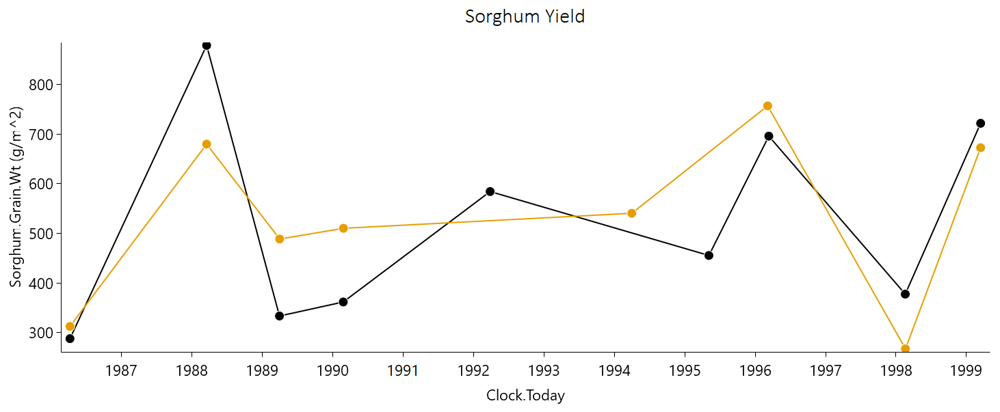

   Timeseries of sorghum grain yield for the continuous simulation (black) and annual resetting (yellow).

There are a number of interesting patterns in the simulation results. 
Both simulation setups produce rather similar results at the very beginning of the timeseries.
They both observe the required conditions for sowing a crop during the first sowing window (1 Nov 1985- 10 Jan 1986).
Until the first crop harvest in April 1986, the *continuous-simulation* considered all changes in soil water and nutrients from 1 Jan 1985. 
In contrast, the *reset-simulation* applied a first reset of conditions on 1 May 1985.
This resulted in a slightly higher soil water content under the *reset-simulation*, which translated into a marginally higher yield, but no major differences overall.

Both simulation scenarios do not simulate any sowing in the next cultivation season (1986/87), as the sowing conditions are not met.
Under the *continuous-simulation* scenario, this leads to the advantage of cumulating rainfall as soil water content.
Instead, the *reset-simulation* falls back to the predefined starting conditions of a soil profile that is 50% filled on 1 May of every year.
As a consequence, in the next cultivation season (1987/88) the *continuous-simulation* (8.8 t/ha) produces a considerably higher yield
than the *reset-simulation* (6.8 t/ha).

In the subsequent seasons (1988/89 and 1989/90), the opposite trend can be observed: 
When the water in the soil profile is depleted from the preceding season(s), the *reset-simulation* benefits from being reset to a 50% filled soil profile, 
resulting in higher yields as a consequence.

Another notable pattern can be observed in the 1991/92 cultivation season. 
Here, the sowing conditions are met only under the *continuous-simulation*, 
which benefits from additional soil water storage carried over from the directly preceding fallow seasons. 
In contrast, the *reset-simulation* does not meet the required conditions to trigger a sowing event.

Let us now consider the timeseries results for volumetric water content and organic carbon across the entire soil profile.

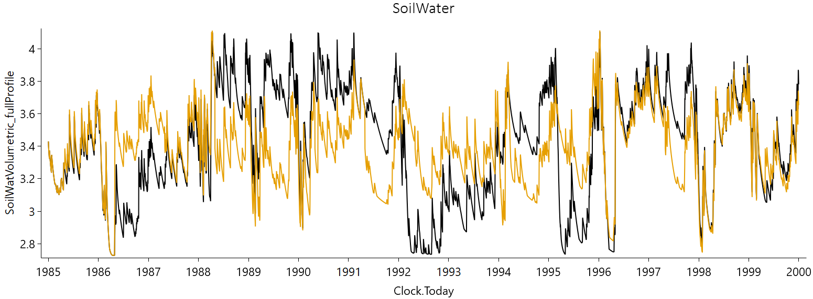

   Timeseries of **volumetric water content** across the soil profile for the continuous simulation (black) and annual resetting (yellow).

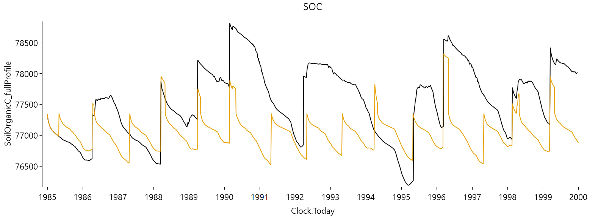

   Timeseries of **soil organic carbon** across the soil profile for the continuous simulation (black) and annual resetting (yellow).

Here, we can confirm the earlier provided interpretation for the differences in crop yields: 

The *continuous-simulation* is characterised by larger fluctuations in soil water, reflecting both periods of near-full and depleted profiles. 
This arises from the carry-over of soil water from one season to the next, allowing extremes to build up and persist. 
In contrast, the *reset-simulation* exhibits reduced fluctuations and amplitude, as annual resetting prevents build up and persistance of extreme values. 
A similar pattern is observed in the timeseries of Soil Organic Carbon. 
Beyond the impact of soil water resetting on biomass production, a low amplitude in soil organic carbon is further driven by the annual resetting of the surface organic matter pool.

A thorough understanding of these principle differences between crop model simulations that are based on the carry-over versus resetting of *state variables* is highly instrumental to crop modellers.
For instance, it can inform the interpretation of results from popular long-term simulation studies that employ the resetting of *state variables*, 
such as the `Agricultural Model Intercomparison and Improvement Project (AgMIP) <https://agmip.org/>`_.

Conclusion
-------------------------------------
The above section provided you with an introduction of how to transition from the simulation of a single crop cycle, from sowing to harvest, 
to continuous cropping with *state variables* that carry over between seasons.
However, the above setup is not suitable to represent different alternating crops, such as of fixed crop rotations.
It also does not allow for more complex, rule-based crop sequencing scenarios in which crop choice depends opportunistically on observed seasonal conditions.
The ability to represent more realistic and complex crop sequences and crop rotations is the focus of the next section.

