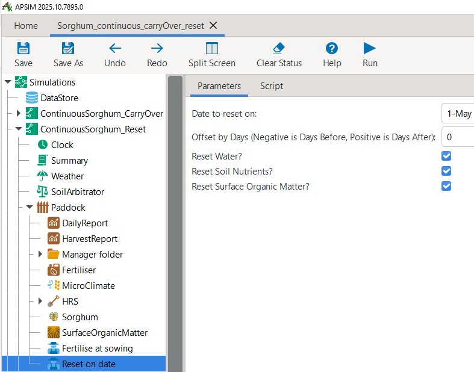

Continuous Cropping of a Single Crop
=====
The most classical starting point in the learning and usage of crop models is the simulation of a single crop cycle, from sowing to harvest.
For instance, when crop models are used to simulate the observed crop growth from agricultural field trials, 
each trial treatment is represented by simulating a single crop cycle. 
This is the most common approach even when the experimental data come from continuous, multi-year trials on identical plots.
Crop model simulations of single crop cycles are typically used for crop model calibration and evaluation. 
Once calibrated, the crop model can be employed for more analytical purposes, 
such as assessing the impact of a shift in management practices or changing environmental conditions (e.g., climate change) 
on crop growth processes, crop yield, and further outcome indicators. 

The section at hand builds on this classical starting point by demonstrating how to set up and run a simple long-term simulation of a single crop that is grown continuously over multiple years.
Thereby, we primarily consider the case of simulating the continuous carry-over of soil water and nutrient states between subsequent crop cycles. 
For comparison, we also briefly consider the alternative case of resetting soil water and nutrient states at the beginning of each crop cycle.
In a subsequent step, more complex crop rotation scenarios will be considered.

Continuous Single Crop Simulation with State Carry-Over
-------------------------------------
Extending the simulation of a single crop cycle to the repeated, continuous growth of the same crop over multiple years can easily be achieved in APSIM.
It predominently entails:

- Extending the start and end dates of the simulation in the clock-node of the simulation tree to the desired multi-year period.
- Specifying rule-based management actions - such as for sowing, fertilisation, and irrigation - based on desired triggers, such as fixed dates, or more commonly, state variable thresholds.

For instance, consider the two example APSIM files ``Sorghum.apsimx`` and ``Wheat.apsimx`` included with the APSIM installation,
which you can access by selecting "Open an Example" from the top toolbar of the APSIM graphical user interface (GUI).

.. figure:: _static/APSIMscreenshot_topLevelToolbar.png
   :alt: APSIM top-level toolbar
   :width: 100%

   Top toolbar from the APSIM GUI, showing the "Open an Example" button.

Instead of simulating the respective crop over a single season, both files simulate continuous crop growth over a period of 100 years, from 1900 to 2000.
You can explore both files and the simulation results by opening and running them in your own time.

To better understand the steps and details of continuous simulations of single crops, we will utilise a modified version of the file ``Sorghum.apsimx`` as a starting point.
It can be accessed here: `Sorghum_continuous_carryOver.apsimx <_APSIM_code/Sorghum_continuous_carryOver/Sorghum_continuous_carryOver.apsimx>`_.
For obtaining the best value from this guide, we suggest you to open the file in your local copy of the APSIM software and follow along for the remainder of the tutorial.

This example file simulates sorghum in Dalby (Queensland, Australia). However, instead of simulating exclusively a single crop cycle, from sowing to harvest,
the simulation runs continuously from its **start date** on 1/01/1985 to its **end date** on 31/12/1999, covering a total of 15 years.
In the simulation tree structure shown on the left-hand side of the APSIM GUI, you can inspect these values by navigating to
the ``Clock`` node.

.. figure:: _static/APSIMscreenshot_ContSorghumCarryOver_Clock.png
   :alt: APSIM Clock node
   :width: 80%

   Clock node from the APSIM GUI, showing the start and end dates of the simulation.

A core aspect of continuous simulations is to specify the timing of all core management actions.
The most simple option is the specification of fixed dates. 
This can be a suitable choice for thought experiments, such as the analysis of consistently planting early or late in the season.
However, the more common choice for continuous simulations is to define the timing of management actions based on state-variables reaching certain thresholds.
This could refer to a minimum level of soil water content, a cumulative rainfall threshold, a certain crop developmental stage being reached, or a time period elapsed since the last management action, among other thresholds.
Such ``SowingRules`` are specified via *manager scripts*. 
For our example, when clicking on the ``SowingRule`` node in the simulation tree, you can see that sorghum is sown if the following criteria are fulfilled:

- The date falls within the sowing window from 1st November to 10th January.
- Extractable soil water exceeds 120 mm.
- Cumulative rainfall exceeds 50 mm in the preceding 7-day period.

   The sowing rule manager script indicating the required conditions for sowing to be initiated by APSIM.

As always in APSIM, you can see that many pre-defined functions are available through predefined *manager scripts*.
You can see further alternative sowing rules by clicking on ``Home`` > ``Management toolbox`` > ``Plant``.

.. figure:: _static/APSIMscreenshot_MgmtToolbox.png
   :alt: APSIM MgmtToolbox
   :width: 35%

   Overview of predefined sowing rules under the **Plant** folder in the APSIM Management toolbox.

While these predefined *manager scripts* provide many functionalities, APSIM transparently exposes the underlying **C# code** under the ``Script`` tab.
Instead of using predefined *manager scripts*, this directly allows users to write their own customised rules for management actions.
For users who are not familiar with C#, the predefined *manager scripts* provide a useful starting point for modifying and extending rules as needed.

.. figure:: _static/APSIMscreenshot_ContSorghumCarryOver_SowingRuleScript.png
   :alt: APSIM SowingRuleScript
   :width: 80%

   The **C# code** of the sowing rule accessible via the **Script** tab.

Generally, when working with APSIM, it is useful to remember that the GUI is meant as an aid to conducting crop modelling with APSIM.
However, it is not obligatory to use the GUI for all tasks.
For users that prefer to utilise **Code Editors** (such as VS Code, Sublime Text, etc.), 
the simulation tree that is visualised by the APSIM GUI can also directly be edited via a text editor, 
as it is simply a representation of an underlying JSON file.
When you open the current example APSIM file in a text editor, its first rows look like this:

.. figure:: _static/APSIMscreenshot_ContSorghumCarryOver_VSCodeView.png
   :alt: APSIM VSCodeView
   :width: 80%

   The **JSON File** structure of an **apsimx-file**.

Equivalently as for sowing, the timing of fertiliser application is also defined based on another variable.
Here, all fertiliser is applied at sowing. 
However, we also could apply top-up fertiliser upon reaching a later crop development stage.
The predefined *manager script* ``Fertilise at sowing`` implements this.

.. figure:: _static/APSIMscreenshot_ContSorghumCarryOver_FertiliserManager.png
   :alt: APSIM Fertiliser Manager
   :width: 80%

   The fertilisation *manager script*.

When conducting multi-year simulations, a range of outcome variables can be of interest.
As always, crop yield is a key variable.
In addition, also soil nutrient and soil water conditions may be highly relevant.
In this example, we included separate graphs for crop yield, soil organic carbon, and soil volumetric water content (each across the full soil profile).
To conveniently include the sum of certain state variables across the full soil profile in the simulation results,
we added the following code to our results variables in the *results node* ``DailyReport``:

.. code-block:: console

    # Total soil organic carbon across the soil profile
    Sum([Soil].Nutrient.Organic.C) as SoilOrganicC_fullProfile

    # Total volumetric water content across the soil profile
    Sum([Soil].Water.Volumetric) as SoilWatVolumetric_fullProfile

Please now run the simulation by clicking ``Save`` and then ``Run``.
You can now inspect the results by selecting the *graph node* ``Sorghum Yield``.
As you can seen, in only 9 of the 15 years a sorghum crop was harvested.
Accordingly, in the remaining years, either the sowing conditions were not satisfied (so that no crop was planted)
or the crop failed prior to producing any grain yield.
Further, the high level of yield variability can be noted, ranging from 2.9 t/ha to 8.8 t/ha.

.. figure:: _static/APSIMscreenshot_ContSorghumCarryOver_GrainYield.png
   :alt: APSIM Grain Yield
   :width: 100%

   Sorghum grain yield - continuous cropping with state carry-over.

Continuous Single Crop Simulation Without State Carry-Over
-------------------------------------
Let us now compare the above results to the simulation result when resetting major state variables after each crop cycle. 
Specifically, we will reset soil water, soil nutrient, and surface organic matter pools every year.
For this purpose, let us first save the current example file under the new name *Sorghum_continuous_carryOver_reset.apsimx*.
We then copy the entire simulation tree ``Continuous_Sorghum`` and paste it back into the root node ``Simulations``.
This gives us two identical sub-simulations. Let us rename the first to ``ContinuousSorghum_CarryOver`` and the second to ``ContinuousSorghum_Reset``.
From any of the two sub-simulations, please also copy all three *graph nodes* ("Sorghum Yield", "SOC", "SoilWater") and paste them into the root node ``Simulations``. 
Expand each graph node and change the value of ``Colour`` to *Vary by SimulationName*.
The resulting tree structure, should look similar to the below example:

.. figure:: _static/APSIMscreenshot_ContSorghumCarryOver_Reset_TreeStructure.png
   :alt: APSIM TreeStructure
   :width: 80%

   Updated structure of the simulation tree: Comparing state carry-over and resetting.

Now, navigate to ``Home`` > ``Management toolbox`` > ``Other`` in the APSIM GUI, 
copy the manager ``Reset on date`` and paste it into the ``Paddock`` node of the simulation ``ContinuousSorghum_Reset``.
An alterantive manager to ``Reset on date`` could have been the option ``Reset on sowing``.
As next step, select the ``Reset on date`` manager, set the date to **1-May** and ensure that all three state variables (water, soil nutrients, surface organic matter) are reset.

   Manager script for annual resetting of state variables: water, soil nutrients, and surface organic matter.

Once completed, save the file, click on the top-level ``Simulations`` node and then click ``Run``.
Then navigate to the *graph node* "Sorghum Yield" located under the root node ``Simulations``.
You should see two timeseries of results:

- In black: results for the simulation **with** state carry-over (continuous simulation)
- In yellow: results for the simulation **without** state carry-over (annual reset on sowing)

.. figure:: _static/APSIMscreenshot_ContSorghumCarryOver_Reset_GrainYieldComparison.png
   :alt: APSIM GrainYieldComparison
   :width: 100%

   Timeseries of sorghum grain yield for continuous simulation (black) and annual resetting (yellow).

There are a number of interesting patterns in the simulation results. 
Both simulation setups produce rather similar results towards the beginning of the timeseries.
They observe both sufficient conditions for sowing a crop on the first occurance (1 Nov 1985- 10 Jan 1986).
Until the first crop harvest in April 1986, the *continuous-simulation* considered all changes in soil water and nutrients
from 1 Jan 1985. Instead, the *reset-simulation* once reset conditions on 1 May 1985.
This provided a small advantage to the *reset-simulation*, but did not introduce any major differences.

Instead, the next cultivation year (1986/87) is skipped by both simulation scenarios due to not meeting the sowing threshold.
This gives the *continuous-simulation* the advantage of storing additional soil water, while the *reset-simulation*
falls back to the initial condition of a 50% filled soil profile on 1 May of every year.
As a consequence, in the next cultivation year (1987/88) the *continuous-simulation* (8.8 t/ha) produces a considerably higher yield
than the *reset-simulation* (6.8 t/ha).

In the subsequent years (1988/89 & 1989/90), the opposite trend can be observed: When the soil profile is dried up from the preceding season(s),
the *reset-simulation* benefits from arbitrarily bouncing back to a 50% filled soil profile and observes higher yields as a consequence.

Another interesting pattern can be seen in the cultivation season 1991/92: 
Here, only the under the *continuous-simulation* the conditions of the sowing rule are fulfilled,
as it benefits from additional soil water storage from directly preceding fallow seasons.
Instead, the *reset-simulation* does not observe sufficient conditions to initiate a sowing event.

Let us now consider the timeseries results for volumetric water and organic carbon across the entire soil profile.

.. figure:: _static/APSIMscreenshot_ContSorghumCarryOver_Reset_GrainYieldComparison.png
   :alt: APSIM SoilWaterComparison
   :width: 100%

   Timeseries of **volumetric water content** across the soil profile for continuous simulation (black) and annual resetting (yellow).

.. figure:: _static/APSIMscreenshot_ContSorghumCarryOver_Reset_GrainYieldComparison.png
   :alt: APSIM SOCComparison
   :width: 100%

   Timeseries of **soil organic carbon** across the soil profile for continuous simulation (black) and annual resetting (yellow).

Here, we can confirm the above interpretation: 
The *continuous-simulation* is characterised by much larger fluctuations towards a cumulatively filled as well as depleted soil profile.
This is a consequence of the ability to carry over both a particularly filled as well as depleted soil profile into a subsequent season.
Instead, the *reset-simulation* observes much less fluctuation and amplitude, as the annual resetting avoids the prolonged observation of any extreme values.
The same pattern is also visible in the timeseries results for Soil Organic Carbon. 
Besides the aforementioned impact of soil water resetting on biomass production, this pattern is further driven by the resetting of surface organic matter.

An understanding of this principle pattern is useful for any crop modeller, for instance when interpreting results from the long-term simulations
conducted by the `Agricultural Model Intercomparison and Improvement Project <https://agmip.org/>`_.

Example: Basic Sphinx project for Read the Docs
-------------------------------------

.. image:: https://readthedocs.org/projects/example-sphinx-basic/badge/?version=latest
    :target: https://example-sphinx-basic.readthedocs.io/en/latest/?badge=latest
    :alt: Documentation Status

.. This README.rst should work on Github and is also included in the Sphinx documentation project in docs/ - therefore, README.rst uses absolute links for most things so it renders properly on GitHub

This example shows a basic Sphinx project with Read the Docs. You're encouraged to view it to get inspiration and copy & paste from the files in the source code. If you are using Read the Docs for the first time, have a look at the official `Read the Docs Tutorial <https://docs.readthedocs.io/en/stable/tutorial/index.html>`__.

📚 `docs/ <https://github.com/readthedocs-examples/example-sphinx-basic/blob/main/docs/>`_
    A basic Sphinx project lives in ``docs/``. All the ``*.rst`` make up sections in the documentation.
⚙️ `.readthedocs.yaml <https://github.com/readthedocs-examples/example-sphinx-basic/blob/main/.readthedocs.yaml>`_
    Read the Docs Build configuration is stored in ``.readthedocs.yaml``.
⚙️ `docs/conf.py <https://github.com/readthedocs-examples/example-sphinx-basic/blob/main/docs/conf.py>`_
    Both the configuration and the folder layout follow Sphinx default conventions. You can change the `Sphinx configuration values <https://www.sphinx-doc.org/en/master/usage/configuration.html>`_ in this file
📍 `docs/requirements.txt <https://github.com/readthedocs-examples/example-sphinx-basic/blob/main/docs/requirements.txt>`_ and `docs/requirements.in <https://github.com/readthedocs-examples/example-sphinx-basic/blob/main/docs/requirements.in>`_
    Python dependencies are `pinned <https://docs.readthedocs.io/en/latest/guides/reproducible-builds.html>`_ (uses `pip-tools <https://pip-tools.readthedocs.io/en/latest/>`_). Make sure to add your Python dependencies to ``requirements.txt`` or if you choose `pip-tools <https://pip-tools.readthedocs.io/en/latest/>`_, edit ``docs/requirements.in`` and remember to run ``pip-compile docs/requirements.in``.
💡 `docs/api.rst <https://github.com/readthedocs-examples/example-sphinx-basic/blob/main/docs/api.rst>`_
    By adding our example Python module ``lumache`` in the reStructuredText directive ``:autosummary:``, Sphinx will automatically scan this module and generate API docs.
💡 `docs/usage.rst <https://github.com/readthedocs-examples/example-sphinx-basic/blob/main/docs/usage.rst>`_
    Sphinx can automatically extract API documentation directly from Python modules, using for instance the ``:autofunction:`` directive.
💡 `lumache.py <https://github.com/readthedocs-examples/example-sphinx-basic/blob/main/lumache.py>`_
    API docs are generated for this example Python module - they use *docstrings* directly in the documentation, notice how this shows up in the rendered documentation.
🔢 Git tags versioning
    We use a basic versioning mechanism by adding a git tag for every release of the example project. All releases and their version numbers are visible on `example-sphinx-basic.readthedocs.io <https://example-sphinx-basic.readthedocs.io/en/latest/>`__.
📜 `README.rst <https://github.com/readthedocs-examples/example-sphinx-basic/blob/main/README.rst>`_
    Contents of this ``README.rst`` are visible on Github and included on `the documentation index page <https://example-sphinx-basic.readthedocs.io/en/latest/>`_ (Don't Repeat Yourself).
⁉️ Questions / comments
    If you have questions related to this example, feel free to can ask them as a Github issue `here <https://github.com/readthedocs-examples/example-sphinx-basic/issues>`_.

Example Project usage
---------------------

This project has a standard Sphinx layout which is built by Read the Docs almost the same way that you would build it locally (on your own laptop!).

You can build and view this documentation project locally - we recommend that you activate `a local Python virtual environment first <https://packaging.python.org/en/latest/guides/installing-using-pip-and-virtual-environments/#creating-a-virtual-environment>`_:

.. code-block:: console

    # Install required Python dependencies (Sphinx etc.)
    pip install -r docs/requirements.txt

    # Enter the Sphinx project
    cd docs/
    
    # Run the raw sphinx-build command
    sphinx-build -M html . _build/

You can also build the documentation locally with ``make``:

.. code-block:: console

    # Enter the Sphinx project
    cd docs/
    
    # Build with make
    make html
    
    # Open with your preferred browser, pointing it to the documentation index page
    firefox _build/html/index.html

Using the example in your own project
-------------------------------------

If you are new to Read the Docs, you may want to refer to the `Read the Docs User documentation <https://docs.readthedocs.io/>`_.

If you are copying this code in order to get started with your documentation, you need to:

#. place your ``docs/`` folder alongside your Python project. If you are starting a new project, you can adapt the `pyproject.toml` example configuration.
#. use your existing project repository or create a new repository on Github, GitLab, Bitbucket or another host supported by Read the Docs
#. copy ``.readthedocs.yaml`` and the ``docs/`` folder into your project.
#. customize all the files, replacing example contents.
#. add your own Python project, replacing the ``pyproject.toml`` configuration and ``lumache.py`` module.
#. rebuild the documenation locally to see that it works.
#. *finally*, register your project on Read the Docs, see `Importing Your Documentation <https://docs.readthedocs.io/en/stable/intro/import-guide.html>`_.

Read the Docs tutorial
----------------------

To get started with Read the Docs, you may also refer to the `Read the Docs tutorial <https://docs.readthedocs.io/en/stable/tutorial/>`__.
It provides a full walk-through of building an example project similar to the one in this repository.
