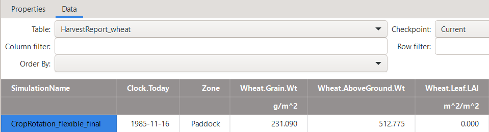
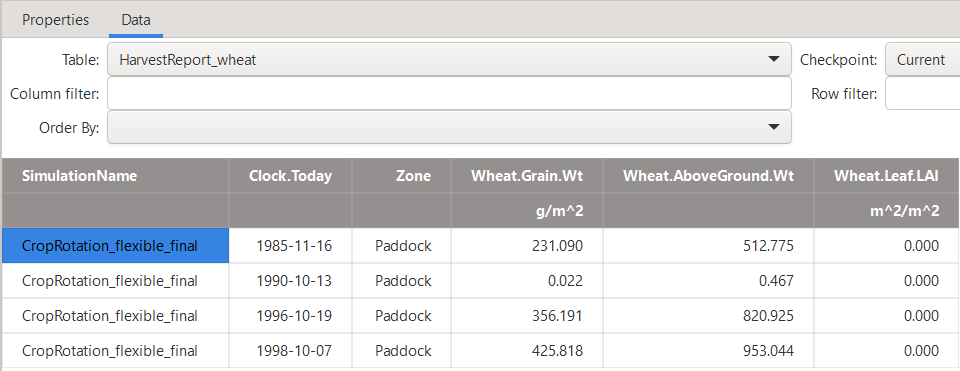

Continuous Cropping on Fixed Dates
========================================
The previous tutorial section discussed the case of generating flexible cropping sequences to represent typical farmer behaviour 
that responds dynamically to changing seasonal conditions.
However, cropping system models are not always used for such forward-looking analyses.
Instead, they are also sometimes applied to represent past cropping histories.
This is, for example, the case when crop models are used to represent observed crop sequences from research farms or farmer-managed on-farm trials.
A classical application is the use of crop modelling to temporally interpolate the values of state variables (such as soil water or soil nitrogen) between observed data points, 
thereby helping to uncover the likely causes of end-of-season outcomes in such experiments (e.g., grain yield or soil carbon levels).
A more recent example is the use of crop models in developing so called *Digital Twins*, 
which aim to replicate observed cropping systems in a detailed, mechanistic manner based on data-rich environments.

These use cases can readily be simulated with the previously presented ``RotationManager`` *model*.
However, as crop sequences are recorded via observed datasets and are thus predetermined,
none of the flexibility and rule-based logic of the ``RotationManager`` is needed.
Indeed, the ``RotationManager`` can make the specification of a cropping sequence with predetermined, fixed dates unnecessarily complicated.

This section will introduce how to use the ``Operations`` *model* to conduct management activities on fixed dates.
As a case study, we will focus on generating the same cropping system simulation that had organically emerged from the imposed rules on minimum soil moisture, minimum rainfall,
and specific crop sequencing rules as defined in the previous tutorial section:
:doc:`Flexible Cropping Sequences</flexible cropping sequences>`.
Only now, we will pretend that all management activities would have been communicated to us based on records of on-farm observation.
Our task is to represent that information in APSIM.

Setup
----------------------------------------
As the starting point, let us use the final *APSIMX file* from the previous tutorial section:  
`CropRotation_flexible_final.apsimx <CropRotation_flexible_final/CropRotation_flexible_final.apsimx>`_.
Please save the file under the new name “CropRotation_fixedDates.apsimx” and 
also rename the simulation node from “Continuous_Sorghum” to “CropRotation_fixedDates”.
Let us clean up the simulation by removing all *manager* scripts as they are no longer needed:

- CropSequenceEnforcer
- SowHarvest_sorghum
- SowHarvest_wheat
- SowHarvest_mungbean
- SowHarvest_chickpea
- Fert_sorghum
- Fert_wheat
- Fert_mungbean
- Fert_chickpea

Further, please also delete the ``RotationManager``.
Instead of controling management actions via the ``RotationManager`` and linked *manager* scripts 
that are triggered on certain events (such as based on: soil moisture thresholds, the day of sowing, or crop maturity),
we will explicitly define all actions fully deterministically on predefined dates.
For this, we need to add the ``Operations`` *model* via right-clicking on the ``Paddock`` *node*,
selecting ``Add model...`` and then double clicking on ``Operations`` 
(alternatively, you can drag-and-drop the ``Operations`` *model* onto the ``Paddock`` *node*).

As you will see, the ``Operations`` *model* provides you with an empty text file.
It is a fixed schedule manager.
Management operations are specified in a row-by-row manner.
Given that we want to reproduce the scenario from the previous tutorial section 
:doc:`Flexible Cropping Sequences</flexible cropping sequences>`,
we are interested in specifying the following activities:

- Sowing crops
- Applying Urea fertiliser
- Harvesting crops

The first actions of interest happen on 1985-06-05 and consist of:

- Sowing of Wheat
- Application of Urea fertiliser at a rate of 100.0 kg/ha (and a depth of 100 mm)

Let us try to implement these two actions in the ``Operations`` *model* with the help of IntelliSense.
The first information that the ``Operations`` *model* expects is the date in the standard format "1985-06-05".
Subsequently, we need to reference the model that we want to conduct an action.
For sowing of wheat, this is the crop model "[Wheat]".
When adding a dot (.) after the reference to the crop model, we can explore the available methods and properties via IntelliSense.
Evidently, in this case, we are interested in the method "Sow()".

Retrieving Method Signatures
----------------------------------------
So far so good. However, IntelliSense does not tell us the method signature 
that identifies which arguments are required by "Sow()".
To find this out, we have a couple of options:

Inspecting Existing Manager Scripts
^^^^^^^^^^^^^^^^^^^^^^^^^^^^^^^^^^^^^^^^
Common operations such as "Sow()" are implemented in many existing manager scripts. 
If we want to know which arguments are commonly used within the method, we can simply open an existing *manager* script and see how it is used there. 
For example, we could navigate back to the ``SowHarvest_wheat`` manager in our previous *APSIMX file* 
`CropRotation_flexible_final.apsimx <CropRotation_flexible_final/CropRotation_flexible_final.apsimx>`_. 
When we navigate to the ``Script`` tab, the method ``SowCrop()`` is defined as:

.. code-block:: csharp
   :caption: "SowCrop()" Method in the manager script "SowHarvest_wheat"
   :linenos:
   
        public void SowCrop()
        {
            Summary.WriteMessage(this, this.FullPath + " - sowing " + GetCropName(), MessageType.Diagnostic);
            Crop.Sow(population: Population, cultivar: CultivarName, depth: SowingDepth, rowSpacing: RowSpacing);
        }

From the above, we can see that the method "Sow()" used by the ``Wheat`` model accepts arguments such as:

- population
- cultivar
- depth
- rowSpacing

The above procedure gives us a rather practical approach to looking up how methods are used.
However, in this way, we only find out which arguments are being passed in this particular call of the method.
There could be more parameters defined in the method’s signature (e.g. optional ones), but they’re simply not used here.
From the above, we also cannot tell in which order the method expects its arguments (in case that we do not want to specify keywords).
To know all possible arguments, you need to find the method definition of "Sow()" in the source code (not just a call to it).

Inspecting the APSIM Source Code
^^^^^^^^^^^^^^^^^^^^^^^^^^^^^^^^^^^^^^^^
The good news is that you can also simply lookup method definitions in the APSIM source code.
The APSIM source code is openly available at the GitHub repository: `ApsimX<https://github.com/APSIMInitiative/ApsimX>`_.
If you start of without any knowledge of the structure of APSIM,
and thus do not know where to look for answers,
the easiest approach is to search for "Sow(" in the APSIM repository.

You will then be provided with a list of all files in which "Sow(" occurs.
We are interested in identifying the file that defines the method.
When looking through the search results for wheat-specific hits,
we see the file "Examples/Wheat.apsimx".
However, that is just an example *APSIMX file* that is distributed with APSIM.
(Certainly, it also shows which arguments the "Sow()" method utilises, but it is not where the method is defined).

For the method definition we need to look instead at the C# code in the file "Models/PMF/Plant.cs".
This already indicates to us that the "Sow()" method is not specifically defined for wheat only, but works across all crops that inherit from the ``Plant`` *model*.
There the method definition is given as the below:

.. code-block:: csharp
   :caption: Excerpt from the "Sow()" method definition in the APSIM Plant model
   :linenos:
   
        public void Sow(string cultivar, double population, double depth, double rowSpacing, double maxCover = 1, double budNumber = 1, double rowConfig = 0, double seeds = 0, int tillering = 0, double ftn = 0.0)
        {
        ...
        }

While the actual method definition is much longer, we are here only interested in the specification of the input parameters that the method accepts.
These are stated in the reproduced line as:

- Required arguments: cultivar, population, depth, rowSpacing
- Optional arguments: maxCover, budNumber, rowConfig, seeds, tillering, ftn

As you can see, in this case, looking up how the method is called in an existing *manager* script would have been sufficient.
However, by consulting the source code, we have full certainty about knowing all arguments that the "Sow()" method accepts.
It also allowed us to understand what required, and what optional arguments are.
In that way, should we want to call the method using positional arguments only, we also can be certain about the order in which we have to supply inputs.

Background is, that C# let's you call a method such as "Sow()" in two ways.
If you provide only the values (i.e., *positional arguments*), the order of the arguments must exactly match the method definition.
Alternatively, you can specify *named arguments* using keyword–value pairs, in which case the order of arguments no longer matters.

This gives us all information we need to work out the next steps and specify our first action within the ``Operations`` *model*.

Specifying Operations
----------------------------------------
So far we had identified the date, references the "[Wheat]" *model*, and specified the "Sow()" method.
Now we can specify the parameter values as follows:

- cultivar: Janz
- population: 25
- depth: 40
- rowSpacing: 500

As mentioned above, you can call "Sow()" either using positional or named arguments.
Accordingly, both of the below procedures are valid and identical:

.. code-block:: csharp
   :caption: C# code for sowing wheat
   :linenos:

    1985-06-05 [Wheat].Sow("Janz", 25, 40, 500)
    1985-06-05 [Wheat].Sow(cultivar: "Janz", population: 25, depth: 40, rowSpacing: 500)
   
The second operation that we wanted to specify is the application of Urea on the same day as sowing.
For this, we again start of by specifying the date, 
while then referencing the APSIM *model* that is conducting the action - in this case ``[Fertiliser]``.
Using IntelliSense, we see that the method we would like to use is ``Apply()``.
When searching for "Apply(" within the APSIM source code on GitHub,
we see that the file "Models/Management/Fertiliser.cs" specifies that the method accepts the below arguments:

- amount (required)
- type (required)
- depth (optional)
- depthBottom (optional)
- doOutput (optional)

.. code-block:: csharp
   :caption: Excerpt from the "Apply()" method definition in the APSIM Fertiliser model
   :linenos:
   
        public void Apply(double amount, string type, double depth = 0, double depthBottom = -1, bool doOutput = true)
        {
        ...
        }

Accordingly, we define the fertiliser application operation as follows:

.. code-block:: csharp
   :caption: C# code for fertilising wheat at sowing
   :linenos:

    1985-06-05 [Fertiliser].Apply(100, "UreaN", 100)

The next field operation that we are interested in is crop harvesting,
which occured on 1985-11-16.
From our previous *manager* scripts for sowing and harvesting, we know that this method is very simple.
Accordingly, we can just rely on that knowledge to specify the operation as follows:

.. code-block:: csharp
   :caption: C# code for wheat harvesting
   :linenos:

    1985-11-16 [Wheat].Harvest()

When we run the simulation and then navigate to the ``Data`` tab under ``HarvestReport_wheat`` we see the following result:

   Harvest report for wheat: current simulation scenario.

We can compare this to the ``HarvestReport_wheat`` from our previous tutorial section 
:doc:`Flexible Cropping Sequences</flexible cropping sequences>`:

   Harvest report for wheat: previous simulation scenario ("Flexible Cropping Sequences").

As you can see, the harvested wheat yield on 1985-11-16 is identical in both cases.
Although we have utilised two very different approaches to specify the APSIM simulations,
the actual operations simulated (and subsequent results) were identical.
You may also want to investigate this in more detail by reading through the simulation log stored in ``Summary``.

For comparison, the final version of the *APSIMX file* generated in this tutorial is accessible here:
`CropRotation_fixedDates.apsimx <CropRotation_fixedDates/CropRotation_fixedDates.apsimx>`_

In a similar way, you could continue to generate entries in the ``Operations`` *model* for all field operation that occured in our previous tutorial section 
:doc:`Flexible Cropping Sequences</flexible cropping sequences>`. 
The resulting outputs should be fully identical.

Conclusion
----------------------------------------
This tutorial section showed how to use the ``Operations`` *model* to represent management actions that occured on fixed dates.
Using the ``Operations`` *model* is a suitable option for representing observed cropping data, for example from research farms or farmer-managed on-farm trials.
The ``Operations`` *model* is instead not suitable for forward looking simulations that aim at dynamically triggering field operations
based on rules and conditions, for example based on thresholds of soil moisture or the reaching of specific plant physiological stages.

References
----------------------------------------

.. _Brown et al., 2014:

Brown, H. E., Huth, N. I., Holzworth, D. P., Teixeira, E. I., Zyskowski, R. F., Hargreaves, J. N. G., & Moot, D. J. (2014). Plant Modelling Framework: Software for building and running crop models on the APSIM platform. Environmental Modelling & Software, 62, 385-398. https://doi.org/10.1016/j.envsoft.2014.09.005 

