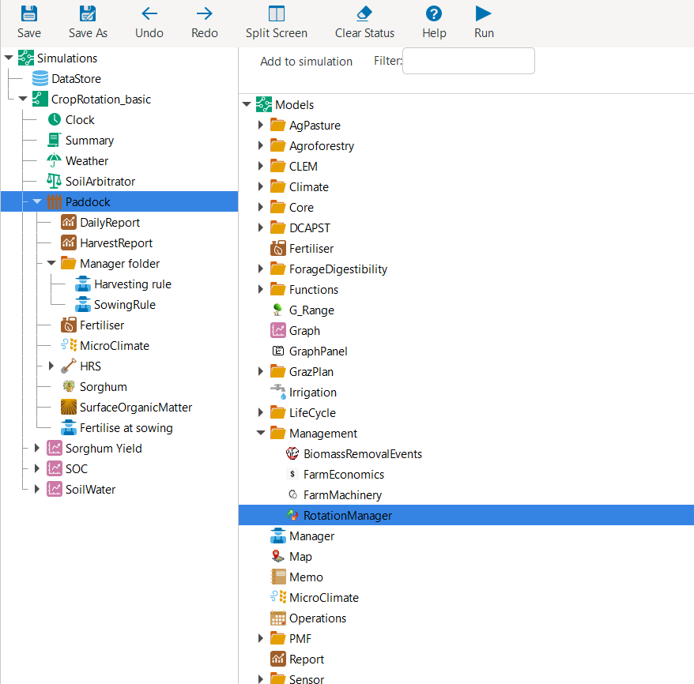

Crop Rotations and Sequences
=====
When simulating crop production on a field over an extended period, 
the previous assumption of continuously cultivating a single crop with fixed management practices is rarely applicable. 
To represent predetermined crop rotations of multiple crops as well as highly flexible crop sequences, APSIM provides the ``RotationManager`` *model*. 
In the following, we will first have a look at the basic usage of the ``RotationManager`` *model*.
Subsequently, we will present various approaches for representing increasingly complex, user-specific crop rotation and sequencing scenarios.

Basic Overview of the Rotation Manager
-------------------------------------
In the following section, we will develop a simple crop rotation scenario in APSIM from the ground up.
As starting point, we will again utilise the earlier simulation of continuous Sorghum in Dalby: 
`Sorghum_continuous_carryOver.apsimx <_APSIM_code/Sorghum_continuous_carryOver/Sorghum_continuous_carryOver.apsimx>`_.
Please save the file under the new name *"CropRotation_basic.apsimx"* and also rename the simulation *node* from *"Continuous_Sorghum"* to *"CropRotation_basic"*.
To add the ``RotationManager`` *model* to the simulation tree, right-click on the ``Paddock`` *node*, click on ``Add model...``, 
expand the  ``Management`` folder, and double click on ``RotationManager`` 
(alternatively, you can drag-and-drop the ``RotationManager`` onto the ``Paddock`` *node*).

   Adding the Rotation Manager model to the simulation tree.

The ``RotationManager`` consists of a graphical bubble chart with which you can represent a crop rotation.
For our first example, we will aim at generating the crop rotation "Sorghum-Fallow-Mungbean-Fallow".
The crop rotation exclusively comprises summer crops and is rigidly predefined, 
without accommodating alternative crop choices in response to varying environmental conditions.
At the starting point, the ``RotationManager`` is blank.
To add your first crop, right-click on the black canvas and select *"Add node"*.
Rename the *node* (i.e., bubble) to "Sorghum".
In the right-hand bottom corner, you may also add a further description (optional) and change the *node* colour.
For example, we selected a colour that is similar to the colour of sorghum heads. 
Please also select the tick boxes *"Top Level"* and *"Verbose Mode"*.
Subsequently, repeat these steps three further times to generate a total of four *nodes* for each plot occupation in the crop rotation.
Please drag the *nodes* on the canvas into the order of the intended rotatation "Sorghum-Fallow-Mungbean-Fallow".
Further, do not name several *nodes* identically (e.g., avoid that two *nodes* are called "Fallow") as this would prevent us from uniquely identifying to which *node* we are referring to later.
To easily distinguish between the two fallows, we name them Fallow_postSG for the fallow following sorghum, and Fallow_postMB for the fallow following mungbean.
Your bubble chart should now look similar to one of the below figures.
There are many ways how you can graphically organise the bubble chart.
Two common ways are to structure it as row sequence or circle.

.. figure:: _static/APSIMscreenshot_BubbleChart_basic_row.png
   :alt: BubbleChart_basic_row
   :width: 100%

   Bubble chart of a simple crop rotation - organised as row sequence.

.. figure:: _static/APSIMscreenshot_BubbleChart_basic_circle.png
   :alt: BubbleChart_basic_circle
   :width: 100%

   Bubble chart of a simple crop rotation - organised as circle.

While the *nodes* represent the different possible field occupations, the next step is to connect the *nodes* with arcs.
Arcs define the transitions the we request APSIM to simulate.
Please add a single arc each for the desired transitions of our rotation plan "Sorghum-Fallow-Mungbean-Fallow".
For this, right-click on a *node* and select ``Add arc``, drag the arc to the *node* it shall transition to,
and click on the *node* to lock-in the arc.
Optionally, you can rename the arcs to more descriptive labels.
For example, below we chose the labels "Enter Sorghum", "Exit Sorghum", "Enter Mungbean", "Exit Mungbean".
The resulting bubble chart should look similar to the following:

.. figure:: _static/APSIMscreenshot_BubbleChart_nodesWithArcs.png
   :alt: BubbleChart_nodesWithArcs
   :width: 100%

   Addition of arcs to bubble chart.

The above bubble chart gives us the basic crop rotation structure that we will work with for this example.
It exactly identifies in which sequence crops and fallows will be simulated.
When clicking on any of the arches, you will see that these transition rules require two arguments:

- **Conditions** that specify under which circumstances the simulation will transition from the starting node of the arc to the ending node of the arc.
- **Actions** that specify which activities are carried out as part of the transition.

At this stage, we did not yet specify any conditions and actions, which is the focus of the next subsection. 

Transitioning between Plot States
-------------------------------------
To have a clean starting point for the definition of crop management rules, 
please first delete the current ``Manager folder`` from the simulation tree (under the ``Paddock`` *node*).
Let us now utilise one of the principles we mentioned earlier:
Instead of writing **C# code** from scratch, 
we can use scripts from both the *Management toolbox* as well as example *APSIMX files* that are distributed with the software as our starting point.
For this, navigate to ``Home`` > ``Open an example`` and opent the example file *"Rotation.apsimx"*.
This is an example crop rotation file that is distributed with APSIM and that you may want to explore at your own time in more detail.
Here, we will copy a useful script that manages crop sowing and harvesting and use it within our simulation.
To copy the script, expand the simulation tree and navigate to ``Crop Pasture`` > ``Field``, copy the ``OatsManager``, 
and paste it into the ``Paddock`` *node* of our simulation *"CropRotation_basic"*.
As we will need two of these *manager* scripts, paste it a second time into the ``Paddock`` *node*.
Rename the manger *nodes* to ``SowHarvest_sorghum`` and ``SowHarvest_mungbean``.

For fertilisation, we can instead continue to use our previous *manager* script.
Please copy the ``Fertilise at sowing`` script, so that we again have two versions of it.
Rename the *managers* to ``Fert_sorghum`` and ``Fert_mungbean``.
The resulting simulation tree should now look similar to the following:

.. figure:: _static/APSIMscreenshot_SimTreeWithManagers.png
   :alt: SimTreeWithManagers
   :width: 50%

   Simulation tree with updated *manager* scripts.

Copying existing manger scripts saved us a lot of coding work.
While this gives us the correct structure of crop management actions that we want to conduct,
we still need to ensure that the parameter values are all as we want them.
For this, we will step through each *manager* script and modify all necessary parameter values.

Let us start with ``SowHarvest_sorghum``:

- Set the *Crop to manage* to *Sorghum* by selecting it from the drop down list.
- As we copied the crop *manager* from a winter crop (oats), the sowing window is unreasonable. Update its start and end date to the values we previously used for Sorghum in Dalby (start: 1-nov; end: 10-jan).
- For the required soil moisture and rainfall conditions, we also insert the values from our previous sorghum simulation in Dalby (Min. ESW: 120mm; Acc. Rain: 50mm; Rain duration: 7 days).
- Ensure that the *"Must sow?"* tickbox is unticked. If ticked, the script enforces that a crop is sown at the end of the sowing window, even if sowing conditions are not satisfied.
- Update the sowing properties to mirror the earlier parameters used for simulating sorghum in Dalby (Cultiar: Buster; Sowing depth: 30mm; Row spacing: 750mm; Plant population: 10 plants/m2).

When you inspect once more the earlier *manager* script from the continuous sorghum simulation (Sorghum_continuous_carryOver),
you will see that there were some more sorghum-specific parameters in the *manager* script.
These were *"skip row configuration"*, *"tillering method"*, and *"fertile tiller number"*.
However, these sorghum-specific parameters are not available in the crop-generic *manager* script that we are using here.
This provides us with a good opportunity to explore another core ability that one needs to flexibly generate APSIM simulations: 
To modify the **C# code** of *manager* scripts.

Let us first explore which impact it had to change parameter values in the user interface.
After having selected ``SowHarvest_sorghum`` in the simulation tree, select the ``Script`` tab.
This exposes the background **C# code** that we have been modifying by updating values in the user interface.

.. code-block:: csharp
   :caption: APSIM management script *"SowHarvest_sorghum"* written in C#
   :linenos:
   
    using APSIM.Core;
    using Models.Interfaces;
    using APSIM.Shared.Utilities;
    using Models.Utilities;
    using Models.Soils;
    using Models.PMF;
    using Models.PMF.Organs;
    using Models.Core;
    using System;
    using System.Linq;
    using Models.Climate;
    using APSIM.Numerics;

    namespace Models
    {
        [Serializable]
        public class Script : Model, IStructureDependency
        {
            [Link] private Clock Clock;
            [Link] private Summary Summary;
            [Link] private Soil Soil;
            [Link]
            private ISoilWater waterBalance;
            
            public IStructure Structure { private get; set; }
            //[Link] Simulation Simulation;

            [Separator("Script Configuration")]
            [Description("Crop to manage")]
            public IPlant Crop { get; set; }

            [Separator("Sowing Conditions")]
            [Description("Start of sowing window (d-mmm)")]
            public string StartDate { get; set; }
            [Description("End of sowing window (d-mmm)")]
            public string EndDate { get; set; }
            [Description("Minimum extractable soil water for sowing (mm)")]
            public double MinESW { get; set; }
            [Description("Accumulated rainfall required for sowing (mm)")]
            public double MinRain { get; set; }
            [Description("Duration of rainfall accumulation (d)")]
            public int RainDays { get; set; }
            [Tooltip("If enabled, and if sowing conditions are not met, the crop will be sown on the final day of the sowing window.")]
            [Description("Must sow (yes/no)")]
            public bool MustSow { get; set; }

            [Separator("Sowing Properties")]
            [Description("Cultivar to be sown")]
            [Display(Type = DisplayType.CultivarName)]
            public string CultivarName { get; set; }
            [Description("Sowing depth (mm)")]
            public double SowingDepth { get; set; }
            [Description("Row spacing (mm)")]
            public double RowSpacing { get; set; }
            [Description("Plant population (/m2)")]
            public double Population { get; set; }

            public Accumulator accumulatedRain { get; private set; }
            private bool afterInit = false;
                    
            [EventSubscribe("StartOfSimulation")]
            private void OnSimulationCommencing(object sender, EventArgs e)
            {
                if (Crop == null)
                    throw new Exception("Crop must not be null in rotations");
                accumulatedRain = new Accumulator(this, "[Weather].Rain", RainDays);
                Summary.WriteMessage(this, this.FullPath + " - Commence, crop=" + (Crop as Model).Name, MessageType.Diagnostic);
                afterInit = true;
                MonthlyHarvestedWt = 0;
            }
            
            [EventSubscribe("DoManagement")]
            private void DoManagement(object sender, EventArgs e)
            {
                accumulatedRain.Update();
            }

            // Test whether we can sow a crop today
            // +ve number - yes
            // 0          - no
            // -ve number - no, out of scope (planting window)
            [Units("0-1")]
            public int CanSow
            {
                get
                {
                    if (!afterInit)
                        return 0;
                    bool isPossibleToday = false;
                    bool inWindow = DateUtilities.WithinDates(StartDate, Clock.Today, EndDate);
                    bool endOfWindow = DateUtilities.DatesEqual(EndDate, Clock.Today);
                    if (!Crop.IsAlive && inWindow && accumulatedRain.Sum > MinRain && MathUtilities.Sum(waterBalance.ESW) > MinESW)
                        isPossibleToday = true;

                    if (isPossibleToday)
                        return 1;
            
                    if (!Crop.IsAlive && endOfWindow && MustSow)
                        return 1;

                    if (!Crop.IsAlive && !inWindow)
                        return -1;
                    return 0;
                }
            }

            public void SowCrop()
            {
                Summary.WriteMessage(this, this.FullPath + " -  sowing " + (Crop as Model).Name, MessageType.Diagnostic);
                Crop.Sow(population: Population, cultivar: CultivarName, depth: SowingDepth, rowSpacing: RowSpacing);    
            }

            [Units("0-1")] 
            public int CanHarvest
            {
                get
                {
                    if (!afterInit)
                        return (0);
                    //Summary.WriteMessage(this, "canLeave:" + Crop.IsReadyForHarvesting, MessageType.Diagnostic);
                    return Crop.IsReadyForHarvesting ? 1 : 0;
                }
            }

            public void HarvestCrop()
            {
                Summary.WriteMessage(this, this.FullPath + " -  harvesting " + (Crop as Model).Name, MessageType.Diagnostic);
                MonthlyHarvestedWt = (  Structure.FindChild<IModel>("Grain", relativeTo: (INodeModel)Crop) as ReproductiveOrgan).Wt;
                Crop.Harvest();
                Crop.EndCrop();
            }
            
            public double MonthlyHarvestedWt {get; set;}
            [EventSubscribe("StartOfMonth")]
            private void DoStartOfMonth(object sender, EventArgs e)
            {
                MonthlyHarvestedWt = 0;
            }
        }
    }

This C# file defines a custom APSIM management script inside the Models namespace — a logical grouping of related classes. 
The using statements at the top import external APSIM and .NET libraries, allowing access to components such as soil, weather, plants, and utility functions. 
The Script class itself inherits from APSIM’s base Model class and implements the IStructureDependency interface, 
meaning it integrates with APSIM’s simulation framework. 
Inside the class, linked components (e.g., Clock, Soil, Crop) are automatically connected to other simulation modules. 
The script subscribes to simulation events like StartOfSimulation or DoManagement, 
and defines methods and properties that determine when to sow or harvest a crop. 
Overall, the code provides a structured way to embed dynamic crop management logic directly into an APSIM simulation.

For this, when select the ``Script`` tab on the top of the 
; Fertile tillers: 0

Subheading
-------------------------------------

Subheading
-------------------------------------

Example: Basic Sphinx project for Read the Docs
-------------------------------------

.. image:: https://readthedocs.org/projects/example-sphinx-basic/badge/?version=latest
    :target: https://example-sphinx-basic.readthedocs.io/en/latest/?badge=latest
    :alt: Documentation Status

.. This README.rst should work on Github and is also included in the Sphinx documentation project in docs/ - therefore, README.rst uses absolute links for most things so it renders properly on GitHub

This example shows a basic Sphinx project with Read the Docs. You're encouraged to view it to get inspiration and copy & paste from the files in the source code. If you are using Read the Docs for the first time, have a look at the official `Read the Docs Tutorial <https://docs.readthedocs.io/en/stable/tutorial/index.html>`__.

📚 `docs/ <https://github.com/readthedocs-examples/example-sphinx-basic/blob/main/docs/>`_
    A basic Sphinx project lives in ``docs/``. All the ``*.rst`` make up sections in the documentation.
⚙️ `.readthedocs.yaml <https://github.com/readthedocs-examples/example-sphinx-basic/blob/main/.readthedocs.yaml>`_
    Read the Docs Build configuration is stored in ``.readthedocs.yaml``.
⚙️ `docs/conf.py <https://github.com/readthedocs-examples/example-sphinx-basic/blob/main/docs/conf.py>`_
    Both the configuration and the folder layout follow Sphinx default conventions. You can change the `Sphinx configuration values <https://www.sphinx-doc.org/en/master/usage/configuration.html>`_ in this file
📍 `docs/requirements.txt <https://github.com/readthedocs-examples/example-sphinx-basic/blob/main/docs/requirements.txt>`_ and `docs/requirements.in <https://github.com/readthedocs-examples/example-sphinx-basic/blob/main/docs/requirements.in>`_
    Python dependencies are `pinned <https://docs.readthedocs.io/en/latest/guides/reproducible-builds.html>`_ (uses `pip-tools <https://pip-tools.readthedocs.io/en/latest/>`_). Make sure to add your Python dependencies to ``requirements.txt`` or if you choose `pip-tools <https://pip-tools.readthedocs.io/en/latest/>`_, edit ``docs/requirements.in`` and remember to run ``pip-compile docs/requirements.in``.
💡 `docs/api.rst <https://github.com/readthedocs-examples/example-sphinx-basic/blob/main/docs/api.rst>`_
    By adding our example Python module ``lumache`` in the reStructuredText directive ``:autosummary:``, Sphinx will automatically scan this module and generate API docs.
💡 `docs/usage.rst <https://github.com/readthedocs-examples/example-sphinx-basic/blob/main/docs/usage.rst>`_
    Sphinx can automatically extract API documentation directly from Python modules, using for instance the ``:autofunction:`` directive.
💡 `lumache.py <https://github.com/readthedocs-examples/example-sphinx-basic/blob/main/lumache.py>`_
    API docs are generated for this example Python module - they use *docstrings* directly in the documentation, notice how this shows up in the rendered documentation.
🔢 Git tags versioning
    We use a basic versioning mechanism by adding a git tag for every release of the example project. All releases and their version numbers are visible on `example-sphinx-basic.readthedocs.io <https://example-sphinx-basic.readthedocs.io/en/latest/>`__.
📜 `README.rst <https://github.com/readthedocs-examples/example-sphinx-basic/blob/main/README.rst>`_
    Contents of this ``README.rst`` are visible on Github and included on `the documentation index page <https://example-sphinx-basic.readthedocs.io/en/latest/>`_ (Don't Repeat Yourself).
⁉️ Questions / comments
    If you have questions related to this example, feel free to can ask them as a Github issue `here <https://github.com/readthedocs-examples/example-sphinx-basic/issues>`_.

Example Project usage
---------------------

This project has a standard Sphinx layout which is built by Read the Docs almost the same way that you would build it locally (on your own laptop!).

You can build and view this documentation project locally - we recommend that you activate `a local Python virtual environment first <https://packaging.python.org/en/latest/guides/installing-using-pip-and-virtual-environments/#creating-a-virtual-environment>`_:

.. code-block:: console

    # Install required Python dependencies (Sphinx etc.)
    pip install -r docs/requirements.txt

    # Enter the Sphinx project
    cd docs/
    
    # Run the raw sphinx-build command
    sphinx-build -M html . _build/

You can also build the documentation locally with ``make``:

.. code-block:: console

    # Enter the Sphinx project
    cd docs/
    
    # Build with make
    make html
    
    # Open with your preferred browser, pointing it to the documentation index page
    firefox _build/html/index.html

Using the example in your own project
-------------------------------------

If you are new to Read the Docs, you may want to refer to the `Read the Docs User documentation <https://docs.readthedocs.io/>`_.

If you are copying this code in order to get started with your documentation, you need to:

#. place your ``docs/`` folder alongside your Python project. If you are starting a new project, you can adapt the `pyproject.toml` example configuration.
#. use your existing project repository or create a new repository on Github, GitLab, Bitbucket or another host supported by Read the Docs
#. copy ``.readthedocs.yaml`` and the ``docs/`` folder into your project.
#. customize all the files, replacing example contents.
#. add your own Python project, replacing the ``pyproject.toml`` configuration and ``lumache.py`` module.
#. rebuild the documenation locally to see that it works.
#. *finally*, register your project on Read the Docs, see `Importing Your Documentation <https://docs.readthedocs.io/en/stable/intro/import-guide.html>`_.

Read the Docs tutorial
----------------------

To get started with Read the Docs, you may also refer to the `Read the Docs tutorial <https://docs.readthedocs.io/en/stable/tutorial/>`__.
It provides a full walk-through of building an example project similar to the one in this repository.
