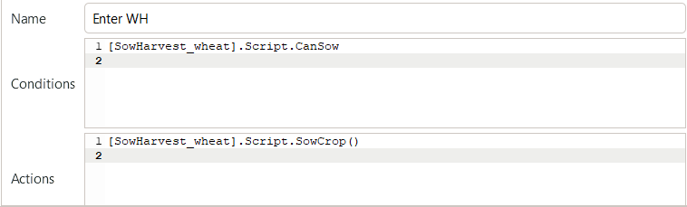
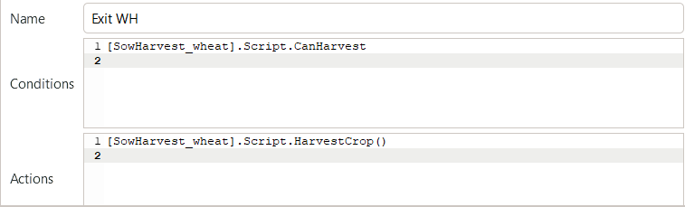
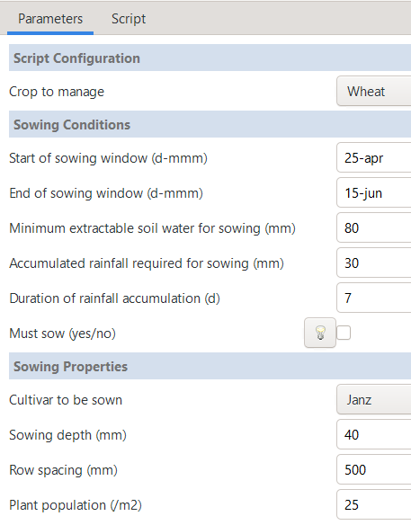

Flexible Cropping Sequences
========================================
The previous tutorial section introduced how to represent predetermined crop rotations in APSIM.
However, whenever cropping system research aims to simulate likely farmer behaviour in a forward looking manner,
the simulation of a fixed, predetermined crop rotation is hardly realistic.
Instead, farm managers often have a couple of typical cropping strategies, between which they will shift quite flexibly based on changing context conditions.
For example, in south-east Queensland, farmers can flexibly change between summer- and winter-dominant cropping patterns based on seasonally changing water availability and soil moisture storage from preceding months.
Another driver of rapid shifts in crop choice can be pest outbreaks (such as the transition out of maize following the introduction and spread of fall armyworm in Australia) 
or pronounced and sudden changes in price incentives (for example, as a consequence to the 30% tariff imposed on chickpea and lentil imports into India in 2017).

In this section, we will explore how to define such flexible cropping sequences that dynamically determine crop choice based on external conditions.

Case Study Context
----------------------------------------
This tutorial focusses on representing a flexible cropping strategy within the exemplary agro-ecological context of the *Darling Downs* growing region.
This production region in South-East Queensland (Australia) is characterised by two major crop growing periods, summer and winter.
The region is characterised by a summer-dominant rainfall pattern and most farmers correspondingly practice a primarily summer-dominant cropping strategy.
However, over the last two decades, the planted area of winter crops has steadily increased.
Many farmers have adopted highly climate-responsive, opportunistic cropping strategies, 
implementing a high cropping intensity whenever adequate water resources are available, regardless of the season.
Evidence of this flexible alternation between summer- and winter-dominant cropping is visible even in aggregate government statistics on the seasonal planted area across Queensland (`ABARES, 2024`_).

In the following, we will aim to represent such an opportunistic cropping strategy within the ``RotationManager`` of APSIM.
It is important to remember, that this scenario serves as an illustrative example only.
Our core focus is to demonstrate a workflow in APSIM that can readily be transferred to other agro-ecological settings and applications.
For example, in production regions where a wheat-dominant crop rotation is largely predetermined, such as in parts of Western Australia, 
there is little value in configuring a ``RotationManager`` that represents flexible crop choices.

In such contexts, the design logic presented in this tutorial can instead be applied to other dynamic aspects of the local cropping system, for example, 
simulating flexible soil management decisions rather than flexible crop choices. 
This could include, for instance, the occasional application of soil amendments such as lime when selected soil properties fall below specified thresholds.

Cropping Scenario
----------------------------------------
As flexible cropping scenario, we consider a hypothetical broadacre farmer in the Darling Downs region
that is generally willing to grow both summer and winter crops, depending on seasonal conditions.
As summer crops, the farmer commonly grows sorghum and mungbean, 
while as winter crops, wheat and chickpea are readily available options.

To keep some realism, but avoid some of the complicated detail that will be involved in simulating a real case study farm,
we will consider here that the farmer determines the crop choice on only two subsequent decisions:

- Absolute water availability
    During the sowing window, a threshold for water availability determines if a crop is sown at all or if the field is left fallow.
    This is exactly similar to the decision logic presented in the previous tutorial section on basic crop rotations.

- Crop sequence: Disease pressure and nitrogen management
    The continuous cropping of cereals or legumes can lead to increased disease pressure and suboptimal nitrogen management.
    Here we will implement the following simple rule: If the previous two cultivated crops were cereals,
    the next crop must be a legume. In all other cases, the next crop must be a cereal.
    Thereby, we will simply consider the last cultivated crops, regardless of whether the plot has intermittently been left fallow.

The above rules have been chosen on purpose for this tutorial, 
as they demonstrate how to implement conditions that depend on both 
(i) the progression of the simulation (i.e., the previous crops grown), and 
(ii) the prevailing environmental conditions (i.e., water availability).
While the specific rules that you will require for your own study cases are likely to differ,
many cases can be represented by the general logic presented here.

Crop Sequence Diagram
----------------------------------------
The first step in implementing the above flexible cropping strategy 
is to represent the desired crop sequences within the ``RotationManager``.
In other words, we have to generate a suitable bubble chart.

As a starting point for this tutorial section, please utilise the following *APSIMX file*:
`CropRotation_flexible_start.apsimx <_APSIM_code/CropRotation_flexible_start/CropRotation_flexible_start.apsimx>`_.
Using an existing *APSIMX file* as the starting point, allows to skip over some aspects already covered in previous tutorial sections
and instead focus on the new aspects relevant for flexible cropping sequences. If you compare the simulation tree in the provided *APSIMX file* with the one shown in the previous tutorial section on basic crop rotations (`CropRotation_basic.apsimx <_APSIM_code/CropRotation_basic/CropRotation_basic.apsimx>`_),
you will notice that there are a number of modifications and updates already done:

- Crop models for a total of four crops are included in the simulation tree (sorghum, mungbean, wheat, chickpea).
- Draft *manager* scripts for sowing and harvesting have been created for each crop (as simple adaptations of the previously used *manager* scripts in *CropRotation_basic.apsimx* and without any thorough update to our new simulation scenario).
- Fertiliser *manager* scripts have been added for each crop.
- Parameters for the soil-crop interactions, specifically the Plant Available Water Capacity (PAWC), have been added for the new crops (under the *Soil node* ``HRS`` -> ``Physical``). 
- The data reporting notes (both daily reports and at harvest) have been updated to account for the new crops.
- The graphing nodes have been updated to account for the new crops.

All these changes require skills and procedures that we have already covered in previous tutorial sections.
Therefore, to keep the tutorial focused on the new aspects and save you from some repetitive tasks,
we have included these scripts and updates as starting point within the provided *APSIMX file*.

Currently, the ``RotationManager`` canvas is empty.
Please take a moment to try and represent the above defined cropping sequence via a suitable bubble chart.
If you work on this solution with a colleague, 
please note that there are many possible ways to represent the desired crop sequence within the ``RotationManager`` canvas.
At this point, it is useful for you to first try to come up with your own solution,
as this will assist you in developing a better conceptual understanding of representing cropping sequences within the ``RotationManager``.
Once you have tried to come up with your own solution, please proceed by unhiding the suggested solutions here below.

.. raw:: html

   

   
<b>Show/Hide Solution: Crop Sequence Diagram</b>

   
The most concise way of representing the cropping sequence (that we could think of) is shown below.
   It minimises the number of crop nodes and transitions (i.e., arcs) required to represent the system.
   Thereby, it is important to not that the <b>"Fallow"</b> node is used to represent both:
   (i) summer as well as winter fallows that last an entire season, and
   (ii) short break periods in autumn and spring that occur between the cultivation of two directly adjacent summer and winter crops.
   

   

   
However, there are many different ways in which one can conceptualise and setup the bubble chart.
   Here below, we show another commonly used alternative, where a separate node for the off-season periods in autumn and spring is created.
   While such nodes are not strictly necessary for representing the system in APSIM, 
   they allow to keep the summer and winter seasons more neatly separated within the bubble chart.
   On the downside, this solution requires slightly more nodes and transitions (i.e., arcs) to represent the system.
   

   

   

    It is important to note that, while an equivalent APSIM simulation can be generated with different bubble chart designs,
    they may often require different manager scripts.
    For the remainder of the tutorial, we will proceed with the first solution shown above.
    We also recommend that you continue working with the same setup,
    as this will make it easier to follow along.
    

    At this stage, we can also add descriptive names to the transitions within the bubble chart.
    When referencing the name of specific transitions, a clear and unambiguous naming convention will avoid any confusion later on.
   

   

   

.. raw:: html

     

Transitioning between Plot States
----------------------------------------
The next step in the ``RotationManager`` is to specify:

- the conditions that trigger each transition between nodes, and
- the actions to be executed whenever a given transition is taken.

For this, we again have to link to *manager* scripts within the ``Paddock`` node of the simulation tree by calling them in the ``RotationManager``.
The overall setup of transition conditions and transition actions is quite trivial,
as it is identical to the procedures presented in the previous tutorial section on basic crop rotations.
Please complete the conditions and action fields in the ``RotationManager``,
so that all *"Enter"* *arcs* have the condition *"CanSow"* and the action *"SowCrop()"*.
Instead, all *"Exit"* *arcs* should have the condition *"CanHarvest"* and the action *"HarvestCrop()"*.
Please make sure to always reference the *manager* script of the intended crop.
For example, the completed box of “Conditions” and “Actions” for wheat (i.e., *"Enter WH"* and *"Exit WH"*) should look like the following:

    Transition conditions and transition actions for wheat.

Now that the overall structure of nodes and transition rules of the cropping sequence has been defined in the ``RotationManager``,
the next step is to update these *manager* scripts that are called upon by the transition rules.
This is the actual more tricky part.
As specified further above, our current *manager* scripts for sowing and harvesting were simply copied from the previous tutorial example.
The only updates that have been implemented so far (as part of the provided starting *APSIMX file*) was to update the parameter values within the *"manager"* scripts to consider reasonable values for each crop (sowing window, planting density, etc.).
For example, when you navigate to the *manager* script ``SowHarvest_wheat``,
you will see that the sowing window dates and sowing properties are using reasonable values for wheat in the Darling Downs region.

    Parameters-tab of the manager script for sowing and harvesting of wheat.

Instead, we now need to verify that the *manager* script correctly represents the further above defined cropping sequencing rules.
For this, it is insufficient to inspect the *Parameters* tab only,
but we will have to consult and modify the **C# code** of the *manager* scripts. 

Absolute Water Availability
^^^^^^^^^^^^^^^^^^^^^^^^^^^^^^^^^^^^^^^^
As identified in the section *Cropping Scenario* above, 
the first decision rule to be implemented is that a crop is only sown if sufficient water is available during the sowing window, 
while otherwise the plot is left in fallow.
When you select any of the current *manager* scripts for sowing and harvesting, e.g. ``SowHarvest_wheat``,
you can identify that they already contain a water availability check identical to the one presented in the previous tutorial section on basic crop rotations.
Accordingly, a crop is only sown if sufficient water resources are available during the sowing window.
No further changes are required from our side.
When you click through the various four sowing and harvest *manager* scripts,
you will notice that the sowing windows slightly vary by crop, 
while the water thresholds differ between summer and winter crops.
Specifically, as we anticipate more in-season rainfall during the summer growing period,
the water threshold for summer crops (sorghum and mungbean) is slightly lower than for winter crops (wheat and chickpea).
Generally, the water thresholds used here are lower than in the previous tutorial section and
will more frequently result in the sowing of a crop rather than leaving the plot fallow.

Crop Sequence: Disease Pressure and Nitrogen Management
^^^^^^^^^^^^^^^^^^^^^^^^^^^^^^^^^^^^^^^^
When now shifting to the issue of representing the crop sequencing rules,
you will notice that no corresponding variables and drop-down menus are available in the current *manager* scripts for sowing and harvesting.
Accordingly, we will need to make dedicated modifications to the **C# code**.

In the previous cases, when we worked with **C# code** in APSIM *manager* scripts,
we predominantly accessed the namespaces, classes, and properties that are defined within the APSIM source code.
We accessed those APSIM components by copying *using directives* (i.e., *namespace imports*) from existing *manager* scripts and 
by exploring available object methods and properties through IntelliSense in the APSIM code editor.
In the current case, we will instead also define some simple variables ourselves to keep track of the previously grown crops.

Default Manager Script
++++++++++++++++++++++++++++++++++++++++
As a first step, let us generate a new *manager* script by right-clicking on the ``Paddock`` node, selecting ``Add model...``, and then choosing ``Manager``.
Rename the new node to ``CropSequenceEnforcer``, as it will enforce the desired crop sequence rules.
The default *manager* script contains some useful placeholder code that is a good starting point for many purposes. 

.. code-block:: csharp
   :caption: Default "Manager" script provided in APSIM
   :linenos:
   
    using System;
    using Models.Core;
    using Models.Interfaces;
    using Models.PMF;
    using APSIM.Shared.Utilities;

    namespace Models
    {
        [Serializable]
        public class Script : Model
        {
            [Link] IClock Clock;
            [Link] ISummary Summary;

            [EventSubscribe("DoManagement")]
            private void DoDailyCalculations(object sender, EventArgs e)
            {
                // Called once per day
            }
        }
    }

The default *manager* script begins with several using directives (i.e., namespace imports).
These imports make the types defined in those namespaces directly available in this script. 
Now, you can refer to them with short names instead of writing their full namespace paths every time.
Subsequently, the script declares the namespace `Models`, which is the standard namespace for all APSIM *manager* scripts.
In a nutshell, any *manager* script that we are creating in the form of user-written C# classes is dynamically compiled at runtime.
For this to work, APSIM expects all classes of *manager* scripts to:

- Be defined within the `Models` namespace
- Inherit from the base class `Model`
- Be decorated with the *[Serializable]* attribute

In C#, *[Serializable]* is an attribute of a class. As you know, *APSIMX files* are written in JSON, while APSIM is written in C#.
When APSIM loads your *APSIMX file*, it deserializes the JSON code into C# objects.
When you save a modified simulation to file, it serializes the C# objects back into JSON.
This only works if all APSIM model classes are serializable.

Subsequently, the code declares a C# class named `Script` that inherits from APSIM's base class *Model*.
By inheriting from `Model`, the class is included in the simulation tree,
gains the ability to link to other APSIM models, and
is able to receive events from the APSIM event system.

*[Link]* allows us to link to other APSIM models and access their properties and methods at runtime.
For example, through the use of *"[Link] ISummary Summary;"* we gain access to the *Summary* node in APSIM,
allowing us to write messages to the summary log.
Similarly, *"[Link] IClock Clock;"* provides access to the simulation clock,
which allows us to dynamically retrieve the current simulation date via *Clock.Today*.

Finally, the script defines a method named *DoDailyCalculations* that is decorated with the *[EventSubscribe("DoManagement")]* attribute.
This attribute indicates that the method should be called whenever the *DoManagement* event is raised.
The *DoManagement* event is raised once per day in APSIM, allowing us to perform daily calculations and updates.
*Manager* scripts typically hook into *DoManagement* because it fires once per day and is designed for management actions (e.g., sowing, fertilizing, irrigation).

Understanding the structure and functionality of the default *manager* script gives us a good first foundation to build customised *manager* scripts.

Helper-Script: Crop Sequence Enforcer
++++++++++++++++++++++++++++++++++++++++
For our example, we will first generate a helper script that will allow our individual crop sowing and harvesting *manager* scripts to enforce the desired crop sequence rules.
For this, please rename the default *Manager* node to ``CropSequenceEnforcer``.
Usually, it is a good idea to keep all the standard using directives provided in the default *manager* script.
After all, we usually do not know at the start from which of the most widely used namespaces, we will need to access classes and methods.
For our current purpose instead, we know that we will generate a very simple and reduced helper script 
that will only require to access the *System* and *Models.Core*. Please remove the other namespace imports from the top of the script.
The overall purpose of the helper script is:

- To remember the two most recently grown crops (no matter which *sowHarvest_* script initiated them).
- To decide which next crop is allowed to be sown based on the previous plot history (cereal vs. legume).
- To record the crop history after each harvest.

Besides defining variables to keep track of the last two grown crops, 
the helper script does not schedule sowing or harvest directly.
Instead, this continues to be carried out by the various *sowHarvest_* scripts that rely on ``CropSequenceEnforcer`` as a utility model.

The placeholder class name *Script* in the default *manager* script is certainly not very useful to be kept.
Please rename the class to ``CropSequenceEnforcer``, as this name better reflects the purpose of the script.

Next, we will define two private string variables to keep track of the last two grown crops.
Initially, these variables should be set to *null*, as we consider that no crops have been grown prior to the start of the simulation.

.. code-block:: csharp
   :caption: Storage variables for previously grown crops
   :linenos:
        // Crop history
        private string previousCrop1 = null;   // Most recent harvested crop
        private string previousCrop2 = null;   // Second most recent harvested crop

Subsequently, we define a public method ``AllowsSowing`` that takes the name of a crop as input and 
returns a boolean value indicating whether sowing that crop is allowed based on the previous crops grown.

.. code-block:: csharp
   :caption: Method "AllowsSowing": Enforcing alternation between cereals and legumes
   :linenos:
        // Check if the proposed crop is allowed under given cropping sequence rules
        public bool AllowsSowing(string crop)
        {
            crop = crop.ToLower();

            bool isCereal  = crop == "sorghum" || crop == "wheat";
            bool isLegume  = crop == "mungbean" || crop == "chickpea";

            if (!isCereal && !isLegume)
                throw new Exception($"CropSequenceEnforcer: Unknown crop '{crop}'.");

            // No history yet → allow only cereals
            if (previousCrop1 == null || previousCrop2 == null)
                return isCereal;

            bool previous_1_wasCereal =
                previousCrop1 == "sorghum" || previousCrop1 == "wheat";

            bool previous_2_wasCereal =
                previousCrop2 == "sorghum" || previousCrop2 == "wheat";

            // Two cereals in a row → enforce a legume
            if (previous_1_wasCereal && previous_2_wasCereal)
                return isLegume;

            // Otherwise → enforce a cereal
            return isCereal;
        }

The method first converts the input crop name to lowercase to ensure case-insensitive comparisons.
It then checks if the proposed crop is a cereal (sorghum or wheat) or a legume (mungbean or chickpea).
If the crop is neither, an exception is thrown indicating an unknown crop.
The method then evaluates the previous two grown crops:

- If there is no history yet (i.e., both previous crops are null), only cereals are allowed to be sown.
- If the last two grown crops were cereals, only legumes are allowed to be sown.
- In all other cases, only cereals are allowed to be sown.

Then, we define a public method ``RecordHarvest`` that takes the name of a harvested crop as input and updates the history of previously grown crops.

.. code-block:: csharp
   :caption: Method "RecordHarvest": Updating crop sequence history
   :linenos:
        // Called at harvest time to update crop sequence history
        public void RecordHarvest(string crop)
        {
            crop = crop.ToLower();

            bool isRotationCrop =
                crop == "sorghum" ||
                crop == "wheat"   ||
                crop == "mungbean"||
                crop == "chickpea";

            if (isRotationCrop)
            {
                previousCrop2 = previousCrop1;
                previousCrop1 = crop;
            }
        }

Finally, we add two public read-only accessors to retrieve the names of the previously grown crops by other scripts.

.. code-block:: csharp
   :caption: Creating public accessors for previous crops
   :linenos:
        // Public read-only accessors
        public string PreviousCrop1 => previousCrop1;
        public string PreviousCrop2 => previousCrop2;

The final version of the helper script ``CropSequenceEnforcer`` should now look as follows:

.. code-block:: csharp
   :caption: Final version of the helper script "CropSequenceEnforcer"
   :linenos:
        using System;
        using Models.Core;

        namespace Models
        {
            [Serializable]
            public class CropSequenceEnforcer : Model
            {
                // Crop history
                private string previousCrop1 = null;   // Most recent harvested crop
                private string previousCrop2 = null;   // Second most recent harvested crop

                // Check if the proposed crop is allowed under given cropping sequence rules
                public bool AllowsSowing(string crop)
                {
                    crop = crop.ToLower();

                    bool isCereal  = crop == "sorghum" || crop == "wheat";
                    bool isLegume  = crop == "mungbean" || crop == "chickpea";

                    if (!isCereal && !isLegume)
                        throw new Exception($"CropSequenceEnforcer: Unknown crop '{crop}'.");

                    // No history yet → allow only cereals
                    if (previousCrop1 == null || previousCrop2 == null)
                        return isCereal;

                    bool previous_1_wasCereal =
                        previousCrop1 == "sorghum" || previousCrop1 == "wheat";

                    bool previous_2_wasCereal =
                        previousCrop2 == "sorghum" || previousCrop2 == "wheat";

                    // Two cereals in a row → enforce a legume
                    if (previous_1_wasCereal && previous_2_wasCereal)
                        return isLegume;

                    // Otherwise → enforce a cereal
                    return isCereal;
                }

                // Called at harvest time to update crop sequence history
                public void RecordHarvest(string crop)
                {
                    crop = crop.ToLower();

                    bool isRotationCrop =
                        crop == "sorghum" ||
                        crop == "wheat"   ||
                        crop == "mungbean"||
                        crop == "chickpea";

                    if (isRotationCrop)
                    {
                        previousCrop2 = previousCrop1;
                        previousCrop1 = crop;
                    }
                }

                // Public read-only accessors
                public string PreviousCrop1 => previousCrop1;
                public string PreviousCrop2 => previousCrop2;
            }
        }

Please note, when you copy and paste all of the above code into the ``CropSequenceEnforcer`` node in the APSIM GUI,
you may need to close and reopen the APSIM code editor to ensure that all changes are correctly reflected.

When sharing code between APSIM users (who often may not have extensive experience with C#), 
one should not blindly trust that standard naming conventions are always followed. 
Still, often it will be handy to have an understanding of some major naming conventions when trying to understand existing C# scripts and 
modify them for own purposes. 
In this example, it is particularly helpful to know that:

- **camelCase** is used for local variables, private fields, and parameters. E.g., the private fields ``previousCrop1`` and ``previousCrop2``, the method parameter ``crop``, and local variables such as ``isCereal`` and ``isLegume``.
- **PascalCase** is used for public types, properties, and methods. E.g., the class name ``CropSequenceEnforcer``, the method names ``AllowsSowing`` and ``RecordHarvest``, and the public properties ``PreviousCrop1`` and ``PreviousCrop2``.

Arbitrarily, let us start with the ``SowHarvest_wheat`` *manager* script and select the ``Script`` tab. 

Subheading
----------------------------------------

Sub-Subheading
^^^^^^^^^^^^^^^^^^^^^^^^^^^^^^^^^^^^^^^^

Sub-Sub-Subheading
++++++++++++++++++++++++++++++++++++++++

References
----------------------------------------

.. _ABARES, 2024:

ABARES. (2024). Snapshot of Australian Agriculture 2024. Australian Bureau of Agricultural and Resource Economics and Science (ABARES). https://doi.org/10.25814/473z-7187
