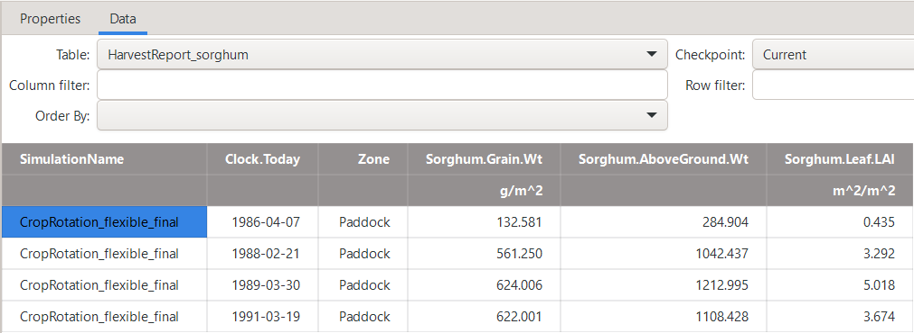
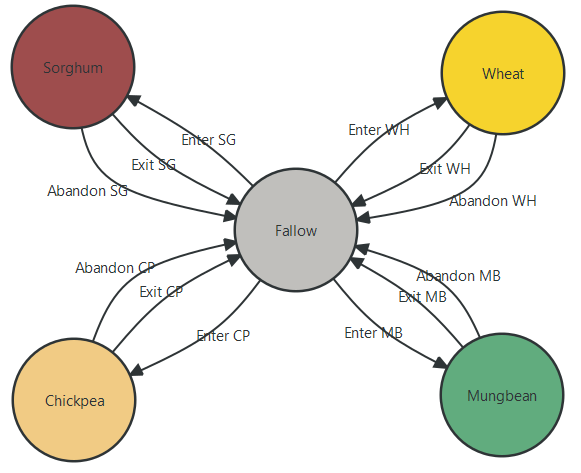
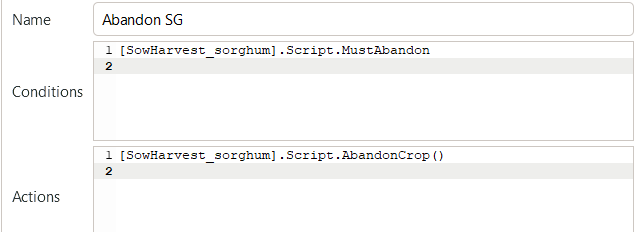
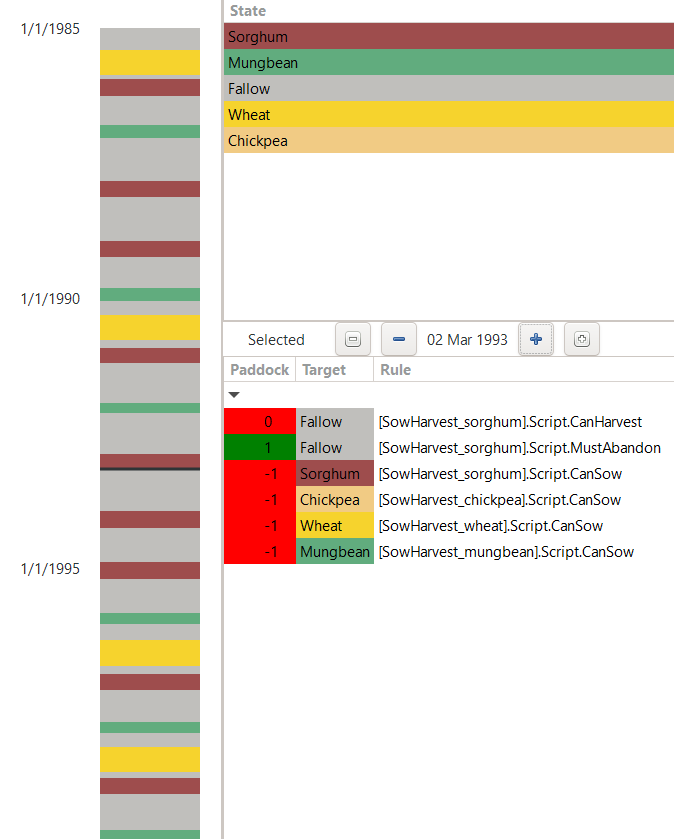

Flexible Cropping Sequences
========================================
The previous tutorial section introduced how to represent predetermined crop rotations in APSIM.
However, whenever cropping system research aims to simulate likely farmer behaviour in a forward looking manner,
the simulation of a fixed, predetermined crop rotation is hardly realistic.
Instead, farm managers often have a couple of typical cropping strategies, between which they will shift quite flexibly based on changing context conditions.
For example, in south-east Queensland, farmers can flexibly change between summer- and winter-dominant cropping patterns based on seasonally changing water availability and soil moisture storage from preceding months.
Another driver of rapid shifts in crop choice can be pest outbreaks (such as the transition out of maize following the introduction and spread of fall armyworm in Australia) 
or pronounced and sudden changes in price incentives (for example, as a consequence to the 30% tariff imposed on chickpea and lentil imports into India in 2017).

In this section, we will explore how to define such flexible cropping sequences that dynamically determine crop choice based on external conditions.

Case Study Context
----------------------------------------
This tutorial focusses on representing a flexible cropping strategy within the exemplary agro-ecological context of the *Darling Downs* growing region.
This production region in South-East Queensland (Australia) is characterised by two major crop growing periods, summer and winter.
The region is characterised by a summer-dominant rainfall pattern and most farmers correspondingly practice a primarily summer-dominant cropping strategy.
However, over the last two decades, the planted area of winter crops has steadily increased.
Many farmers have adopted highly climate-responsive, opportunistic cropping strategies, 
implementing a high cropping intensity whenever adequate water resources are available, regardless of the season.
Evidence of this flexible alternation between summer- and winter-dominant cropping is visible even in aggregate government statistics on the seasonal planted area across Queensland (`ABARES, 2024`_).

In the following, we will aim to represent such an opportunistic cropping strategy within the ``RotationManager`` of APSIM.
It is important to remember, that this scenario serves as an illustrative example only.
Our core focus is to demonstrate a workflow in APSIM that can readily be transferred to other agro-ecological settings and applications.
For example, in production regions where a wheat-dominant crop rotation is largely predetermined, such as in parts of Western Australia, 
there is little value in configuring a ``RotationManager`` that represents flexible crop choices.

In such contexts, the design logic presented in this tutorial can instead be applied to other dynamic aspects of the local cropping system, for example, 
simulating flexible soil management decisions rather than flexible crop choices. 
This could include, for instance, the occasional application of soil amendments such as lime when selected soil properties fall below specified thresholds.

Cropping Scenario
----------------------------------------
As flexible cropping scenario, we consider a hypothetical broadacre farmer in the Darling Downs region
that is generally willing to grow both summer and winter crops, depending on seasonal conditions.
As summer crops, the farmer commonly grows sorghum and mungbean, 
while as winter crops, wheat and chickpea are readily available options.

To keep some realism, but avoid some of the complicated detail that will be involved in simulating a real case study farm,
we will consider here that the farmer determines the crop choice on only two subsequent decisions:

- Absolute water availability
    During the sowing window, a threshold for water availability determines if a crop is sown at all or if the field is left fallow.
    This is exactly similar to the decision logic presented in the previous tutorial section on basic crop rotations.

- Crop sequence: Disease pressure and nitrogen management
    The continuous cropping of cereals or legumes can lead to increased disease pressure and suboptimal nitrogen management.
    Here we will implement the following simple rule: If the previous two cultivated crops were cereals,
    the next crop must be a legume. In all other cases, the next crop must be a cereal.
    Thereby, we will simply consider the last cultivated crops, regardless of whether the plot has intermittently been left fallow.

The above rules have been chosen on purpose for this tutorial, 
as they demonstrate how to implement conditions that depend on both 
(i) the progression of the simulation (i.e., the previous crops grown), and 
(ii) the prevailing environmental conditions (i.e., water availability).
While the specific rules that you will require for your own study cases are likely to differ,
many cases can be represented by the general logic presented here.

Crop Sequence Diagram
----------------------------------------
The first step in implementing the above flexible cropping strategy 
is to represent the desired crop sequences within the ``RotationManager``.
In other words, we have to generate a suitable bubble chart.

As a starting point for this tutorial section, please utilise the following *APSIMX file*:
`CropRotation_flexible_start.apsimx <CropRotation_flexible_start/CropRotation_flexible_start.apsimx>`_.
Using an existing *APSIMX file* as the starting point, allows to skip over some aspects already covered in previous tutorial sections
and instead focus on the new aspects relevant for flexible cropping sequences. If you compare the simulation tree in the provided *APSIMX file* with the one shown in the previous tutorial section on basic crop rotations (`CropRotation_basic.apsimx <CropRotation_basic/CropRotation_basic.apsimx>`_),
you will notice that there are a number of modifications and updates already done:

- Crop models for a total of four crops are included in the simulation tree (sorghum, mungbean, wheat, chickpea).
- Draft *manager* scripts for sowing and harvesting have been created for each crop (as simple adaptations of the previously used *manager* scripts in *CropRotation_basic.apsimx* and without any thorough update to our new simulation scenario).
- Fertiliser *manager* scripts have been added for each crop.
- Parameters for the soil-crop interactions, specifically the Plant Available Water Capacity (PAWC), have been added for the new crops (under the *Soil node* ``HRS`` -> ``Physical``). 
- The data reporting notes (both daily reports and at harvest) have been updated to account for the new crops.
- The graphing nodes have been updated to account for the new crops.

All these changes require skills and procedures that we have already covered in previous tutorial sections.
Therefore, to keep the tutorial focused on the new aspects and save you from some repetitive tasks,
we have included these scripts and updates as starting point within the provided *APSIMX file*.

Currently, the ``RotationManager`` canvas is empty.
Please take a moment to try and represent the above defined cropping sequence via a suitable bubble chart.
If you work on this solution with a colleague, 
please note that there are many possible ways to represent the desired crop sequence within the ``RotationManager`` canvas.
At this point, it is useful for you to first try to come up with your own solution,
as this will assist you in developing a better conceptual understanding of representing cropping sequences within the ``RotationManager``.
Once you have tried to come up with your own solution, please proceed by unhiding the suggested solutions here below.

.. raw:: html

   

   
<b>Show/Hide Solution: Crop Sequence Diagram</b>

   
The most concise way of representing the cropping sequence (that we could think of) is shown below.
   It minimises the number of crop nodes and transitions (i.e., arcs) required to represent the system.
   Thereby, it is important to not that the <b>"Fallow"</b> node is used to represent both:
   (i) summer as well as winter fallows that last an entire season, and
   (ii) short break periods in autumn and spring that occur between the cultivation of two directly adjacent summer and winter crops.
   

   

   
However, there are many different ways in which one can conceptualise and setup the bubble chart.
   Here below, we show another commonly used alternative, where a separate node for the off-season periods in autumn and spring is created.
   While such nodes are not strictly necessary for representing the system in APSIM, 
   they allow to keep the summer and winter seasons more neatly separated within the bubble chart.
   On the downside, this solution requires slightly more nodes and transitions (i.e., arcs) to represent the system.
   

   

   

    It is important to note that, while an equivalent APSIM simulation can be generated with different bubble chart designs,
    they may often require different manager scripts.
    For the remainder of the tutorial, we will proceed with the first solution shown above.
    We also recommend that you continue working with the same setup,
    as this will make it easier to follow along.
    

    At this stage, we can also add descriptive names to the transitions within the bubble chart.
    When referencing the name of specific transitions, a clear and unambiguous naming convention will avoid any confusion later on.
   

   

   

.. raw:: html

     

Transitioning between Plot States
----------------------------------------
The next step in the ``RotationManager`` is to specify:

- the conditions that trigger each transition between nodes, and
- the actions to be executed whenever a given transition is taken.

For this, we again have to link to *manager* scripts within the ``Paddock`` node of the simulation tree by calling them in the ``RotationManager``.
The overall setup of transition conditions and transition actions is quite trivial,
as it is identical to the procedures presented in the previous tutorial section on basic crop rotations.
Please complete the conditions and action fields in the ``RotationManager``,
so that all *"Enter"* *arcs* have the condition *"CanSow"* and the action *"SowCrop()"*.
Instead, all *"Exit"* *arcs* should have the condition *"CanHarvest"* and the action *"HarvestCrop()"*.
Please make sure to always reference the *manager* script of the intended crop.
For example, the completed box of “Conditions” and “Actions” for wheat (i.e., *"Enter WH"* and *"Exit WH"*) should look like the following:

.. figure:: _static/APSIMscreenshot_TransitionActionConditions_EnterWH.png
   :alt: TransitionActionConditions_EnterWH
   :width: 100%

.. figure:: _static/APSIMscreenshot_TransitionActionConditions_ExitWH.png
   :alt: TransitionActionConditions_ExitWH
   :width: 100%

    Transition conditions and transition actions for wheat.

Now that the overall structure of nodes and transition rules of the cropping sequence has been defined in the ``RotationManager``,
the next step is to update these *manager* scripts that are called upon by the transition rules.
This is the actual more tricky part.
As specified further above, our current *manager* scripts for sowing and harvesting were simply copied from the previous tutorial example.

The only modifications made so far in the provided starting APSIMX file were adjustments to the manager script parameters to use reasonable values for each crop (sowing window, planting density, etc.).
For example, when you navigate to the *manager* script ``SowHarvest_wheat``,
you will see that the sowing window dates and sowing properties are set to reasonable values for wheat in the Darling Downs region.

.. figure:: _static/APSIMscreenshot_SowHarvest_wheat.png
   :alt: SowHarvest_wheat
   :width: 50%

    Parameters-tab of the manager script for sowing and harvesting of wheat.

Instead, we now need to verify that the *manager* script correctly represents the further above defined cropping sequencing rules.
For this, it is insufficient to inspect the *Parameters* tab only,
but we will have to consult and modify the **C# code** of the *manager* scripts. 

Absolute Water Availability
^^^^^^^^^^^^^^^^^^^^^^^^^^^^^^^^^^^^^^^^
As identified in the section *Cropping Scenario* above, 
the first decision rule to be implemented is that a crop is only sown if sufficient water is available during the sowing window, 
while otherwise the plot is left in fallow.
When you select any of the current *manager* scripts for sowing and harvesting, e.g. ``SowHarvest_wheat``,
you can identify that they already contain a water availability check identical to the one presented in the previous tutorial section on basic crop rotations.
Accordingly, a crop is only sown if sufficient water resources are available during the sowing window.
No further changes are required from our side.
When you click through the various four sowing and harvest *manager* scripts,
you will notice that the sowing windows slightly vary by crop, 
while the water thresholds differ between summer and winter crops.
Specifically, as we anticipate more in-season rainfall during the summer growing period,
the water threshold for summer crops (sorghum and mungbean) is slightly lower than for winter crops (wheat and chickpea).
Generally, the water thresholds used here are lower than in the previous tutorial section and
will more frequently result in the sowing of a crop rather than leaving the plot fallow.

Crop Sequence: Disease Pressure and Nitrogen Management
^^^^^^^^^^^^^^^^^^^^^^^^^^^^^^^^^^^^^^^^
When now shifting to the issue of representing the crop sequencing rules,
you will notice that no corresponding variables and drop-down menus are available in the current *manager* scripts for sowing and harvesting.
Accordingly, we will need to make dedicated modifications to the **C# code**.

In the previous cases, when we worked with **C# code** in APSIM *manager* scripts,
we predominantly accessed the namespaces, classes, and properties that are defined within the APSIM source code.
We accessed those APSIM components by copying *using directives* (i.e., *namespace imports*) from existing *manager* scripts and 
by exploring available methods and properties through IntelliSense in the APSIM code editor.
In the current case, we will instead also define some simple variables ourselves to keep track of the previously grown crops.

Default Manager Script
++++++++++++++++++++++++++++++++++++++++
As a first step, let us generate a new *manager* script by right-clicking on the ``Paddock`` node, selecting ``Add model...``, and then choosing ``Manager``.
Rename the new node to ``CropSequenceEnforcer``, as it will enforce the desired crop sequence rules.
The default *manager* script contains some useful placeholder code that is a good starting point for many purposes. 

.. code-block:: csharp
   :caption: Default "Manager" script provided in APSIM
   :linenos:
   
    using System;
    using Models.Core;
    using Models.Interfaces;
    using Models.PMF;
    using APSIM.Shared.Utilities;

    namespace Models
    {
        [Serializable]
        public class Script : Model
        {
            [Link] IClock Clock;
            [Link] ISummary Summary;

            [EventSubscribe("DoManagement")]
            private void DoDailyCalculations(object sender, EventArgs e)
            {
                // Called once per day
            }
        }
    }

The default *manager* script begins with several using directives (i.e., namespace imports).
These imports make the types defined in those namespaces directly available within the script. 
Now, you can refer to them with short names instead of writing their full namespace paths every time.
Subsequently, the script declares the namespace `Models`, which is the standard namespace for all APSIM *manager* scripts.
In a nutshell, any *manager* script that we are creating in the form of user-written C# classes is dynamically compiled at runtime.
For this to work, APSIM expects all classes of *manager* scripts to:

- Be defined within the `Models` namespace.
- Inherit from the base class `Model`.
- Be decorated with the *[Serializable]* attribute.

In C#, *[Serializable]* is an attribute of a class. As you know, *APSIMX files* are written in JSON, while APSIM is written in C#.
When APSIM loads your *APSIMX file*, it deserializes the JSON code into C# objects.
When you save a modified simulation to file, it serializes the C# objects back into JSON.
This only works if all APSIM model classes are serializable.

Subsequently, the code declares a C# class named `Script` that inherits from APSIM's base class *Model*.
By inheriting from `Model`, the class is included in the simulation tree,
gains the ability to link to other APSIM models, and
is able to receive events from the APSIM event system.

*[Link]* allows us to link to other APSIM models and access their properties and methods at runtime.
For example, through the use of *"[Link] ISummary Summary;"* we gain access to the *Summary* node in APSIM,
allowing us to write messages to the summary log.
Similarly, *"[Link] IClock Clock;"* provides access to the simulation clock,
which allows us to dynamically retrieve the current simulation date via *"Clock.Today"*.

Finally, the script defines an empty placeholder method named *DoDailyCalculations* that is decorated with the *[EventSubscribe("DoManagement")]* attribute.
This attribute indicates that the method should be called whenever the *DoManagement* event is raised.
The *DoManagement* event is raised once per day in APSIM, allowing us to perform daily calculations and updates.
*Manager* scripts typically hook into *DoManagement* because it fires once per day and is designed for management actions (e.g., sowing, fertilizing, irrigation).

Understanding the structure and functionality of the default *manager* script gives us a good first foundation to build customised *manager* scripts.

Helper-Script: Crop Sequence Enforcer
++++++++++++++++++++++++++++++++++++++++
For our example, we will first generate a helper script that will allow our individual crop sowing and harvesting *manager* scripts to enforce the desired crop sequencing rules.
The overall purpose of the helper script is:

- To remember the two most recently harvested crops (no matter which *sowHarvest_[Crop]* script initiated them).
- To decide which next crop is allowed to be sown based on the previous plot history (cereal vs. legume).
- To record the crop history after each harvest.

Besides defining variables to keep track of the last two harvested crops, 
the helper script does not schedule sowing or harvesting directly.
Instead, this continues to be carried out by the various *sowHarvest_[Crop]* scripts that rely on ``CropSequenceEnforcer`` as a utility model.

As first step, let us review the *using directives*: 
Usually, it is a good idea to keep all the standard *using directives* provided in the default *manager* script.
After all, we usually do not know at the start from which of the most widely used namespaces we will need to access classes and methods.
For our current purpose instead, we know that we will generate a very simple and reduced helper script 
that will only require to access *System* and *Models.Core*. Please remove the other namespace imports from the top of the script.

Subsequently, please rename the placeholder class *Script* to *CropSequenceEnforcer*,
as this clearly documents the purpose of our class.

Next, we will define two private string variables to keep track of the last two harvested crops.
Initially, these variables should be set to *null*, as we consider that no crops have been grown prior to the simulation start date.

.. code-block:: csharp
   :caption: Storage variables for previously harvested crops
   :linenos:

        // Crop history
        private string previousCrop1 = null;   // Most recent harvested crop
        private string previousCrop2 = null;   // Second most recent harvested crop

Subsequently, we define a public method ``AllowsSowing()`` that takes the name of a crop as input and returns a boolean value.
Based on the history of the previous crops harvested, it indicates if the crop in question can be sown, given our crop sequencing rules.

.. code-block:: csharp
   :caption: Method "AllowsSowing": Enforcing alternation between cereals and legumes
   :linenos:

        // Check if the proposed crop is allowed under given crop sequencing rules
        public bool AllowsSowing(string crop)
        {
            crop = crop.ToLower();

            bool isCereal  = crop == "sorghum" || crop == "wheat";
            bool isLegume  = crop == "mungbean" || crop == "chickpea";

            if (!isCereal && !isLegume)
                throw new Exception($"CropSequenceEnforcer: Unknown crop '{crop}'.");

            // No history yet → allow only cereals
            if (previousCrop1 == null || previousCrop2 == null)
                return isCereal;

            bool previous_1_wasCereal =
                previousCrop1 == "sorghum" || previousCrop1 == "wheat";

            bool previous_2_wasCereal =
                previousCrop2 == "sorghum" || previousCrop2 == "wheat";

            // Two cereals in a row → enforce a legume
            if (previous_1_wasCereal && previous_2_wasCereal)
                return isLegume;

            // Otherwise → enforce a cereal
            return isCereal;
        }

In more detail, the method ``AllowsSowing()`` first converts the input crop name to lowercase to ensure case-insensitive comparisons.
It then checks if the proposed crop is a cereal (sorghum or wheat) or a legume (mungbean or chickpea).
If the crop is neither, an exception is thrown indicating an unknown crop.
The method then evaluates the previous two harvested crops:

- If there is no history yet (i.e., both previous crops are null), only cereals are allowed to be sown.
- If the last two harvested crops were cereals, only legumes are allowed to be sown.
- In all other cases, only cereals are allowed to be sown.

Then, we define a public method ``RecordHarvest()`` that takes the name of a harvested crop as input and updates the history of previous crops.

.. code-block:: csharp
   :caption: Method "RecordHarvest": Updating crop sequence history
   :linenos:

        // Called at harvest time to update crop sequence history
        public void RecordHarvest(string crop)
        {
            crop = crop.ToLower();

            bool isRotationCrop =
                crop == "sorghum" ||
                crop == "wheat"   ||
                crop == "mungbean"||
                crop == "chickpea";

            if (isRotationCrop)
            {
                previousCrop2 = previousCrop1;
                previousCrop1 = crop;
            }
        }

Finally, we add two public read-only accessors that allow our other scripts to retrieve the names of the previously harvested crops.
This may come in handy for logging purposes, although the heavy lifting will be done by the ``AllowsSowing()`` and ``RecordHarvest()`` methods.

.. code-block:: csharp
   :caption: Creating public accessors for previous crops
   :linenos:

        // Public read-only accessors
        public string PreviousCrop1 => previousCrop1;
        public string PreviousCrop2 => previousCrop2;

With these changes in place, the ``CropSequenceEnforcer`` script is now complete.
In case that you are uncertain if you implemented all changes correctly, you can compare your solution to the final version here:
`CropSequenceEnforcer.cs <CropRotation_flexible_final/CropSequenceEnforcer.cs>`_.
Please note, in case that you copy and paste all of the above code into the ``CropSequenceEnforcer`` node in the APSIM GUI,
you may need to close and reopen the APSIM code editor to ensure that all changes are correctly reflected.

This is a good opportunity to review standard C# naming conventions. 
When sharing code with other APSIM users (who may have limited C# experience), 
conventions may not have always been strictly followed. 
Still, understanding the main aspects of typical naming conventions can be very helpful 
when trying to understand existing C# scripts as a starting point before making own modifications. 
In this example, it is particularly useful to know that:

- **camelCase** is used for local variables, private fields, and parameters. E.g., the private fields ``previousCrop1`` and ``previousCrop2``, the method parameter ``crop``, and local variables such as ``isCereal`` and ``isLegume``.
- **PascalCase** is used for public types, properties, and methods. E.g., the class name ``CropSequenceEnforcer``, the method names ``AllowsSowing`` and ``RecordHarvest``, and the public properties ``PreviousCrop1`` and ``PreviousCrop2``.

Said simply, ``previousCrop1`` is used only within ``CropSequenceEnforcer``,
while ``PreviousCrop1`` is accessible within our other scripts.

Updating Sowing and Harvesting Manager Scripts
++++++++++++++++++++++++++++++++++++++++
Now that we have the helper script in place, we can start modifying the sowing and harvesting *manager* scripts.
Specifially, we want to rely on the ``CropSequenceEnforcer`` to ensure that 
the various ``CanSow`` properties enforce the crop sequencing rules, and
that the ``HarvestCrop()`` method records all crops that have been harvested.
Arbitrarily, let us here jointly modify the ``SowHarvest_wheat`` *manager* (while modifications to the three other *manager* scripts are identical).
Please select the ``Script`` tab to access the C# code.

As a first change, we define the private variable *cropSequenceEnforcer* in the script and 
link it to the existing ``CropSequenceEnforcer`` node in the simulation tree, allowing access to its properties and methods.
Please add the following line to the existing *[Link]* statements in ``SowHarvest_wheat``.

.. code-block:: csharp
   :caption: Linking the CropSequenceEnforcer model
   :linenos:

        [Link] private CropSequenceEnforcer cropSequenceEnforcer;

We do not introduce any changes to the subsequent secion in the manager script that
defines the variables exposed in the ``Parameters`` tab.
Instead, directly below that code section, let us define for pure convenience a private variable that 
identifies the current crop name in lowercase  (which will save us from repeatedly typing the same code).

.. code-block:: csharp
   :caption: Private variable of the current crop name (lowercase format)
   :linenos:

        private string GetCropName()
        {
            return (Crop as Model).Name.ToLower();            
        }

We keep the methods ``OnSimulationCommencing()`` and ``DoManagement()`` unchanged.
Instead, we need to update the ``CanSow`` property to enforce the crop sequencing rules.
The main change we need to implement is that ``CanSow`` should return 1 only if, 
in addition to the previous conditions, 
the rules defined in the ``AllowsSowing()`` method of the ``cropSequenceEnforcer`` are also satisfied.
In practice, this means that we have to:

- Access the name of the current crop:
.. code-block:: csharp

        string cropName = GetCropName();
- Add the following condition to all statements returning 1:
.. code-block:: csharp

        cropSequenceEnforcer.AllowsSowing(cropName)

However, since the simulation workflow may not necessarily function without errors,
it is a good practice to also log core information within ``Summary``, APSIM’s built-in logging interface.
Here, the key information we need to keep track of is which crops were previously harvested on the plot (*"PreviousCrop1"* and *"PreviousCrop2"*).
We are adding a print statement that records the field history recognised by our active script:

- Logging core information within the ``Summary`` logging interface:
.. code-block:: csharp

        Summary.WriteMessage(this,
            $"Field history → PreviousCrop1={cropSequenceEnforcer.PreviousCrop1 ?? "null"}, PreviousCrop2={cropSequenceEnforcer.PreviousCrop2 ?? "null"}",
            MessageType.Diagnostic);

The updated code of the ``CanSow`` property should look as follows:

.. code-block:: csharp
   :caption: CanSow property with enforcement of crop sequencing
   :linenos:

        // Test whether we can sow a crop today
        // +ve number - yes
        // 0          - no
        // -ve number - no, out of scope (planting window)
        [Units("0-1")]
        public int CanSow
        {
            get
            {
                if (!afterInit)
                    return 0;

                bool isPossibleToday = false;
                bool inWindow = DateUtilities.WithinDates(StartDate, Clock.Today, EndDate);
                bool endOfWindow = DateUtilities.DatesEqual(EndDate, Clock.Today);

                if (!Crop.IsAlive && inWindow &&
                    accumulatedRain.Sum > MinRain &&
                    MathUtilities.Sum(waterBalance.ESW) > MinESW)
                    isPossibleToday = true;

                string cropName = GetCropName();

                // Case 1: normal sowing
                if (isPossibleToday && cropSequenceEnforcer.AllowsSowing(cropName))
                {
                    Summary.WriteMessage(this,
                        $"Field history → PreviousCrop1={cropSequenceEnforcer.PreviousCrop1 ?? "null"}, PreviousCrop2={cropSequenceEnforcer.PreviousCrop2 ?? "null"}",
                        MessageType.Diagnostic);

                    return 1;
                }

                // Case 2: Must sow on last day of window
                if (!Crop.IsAlive && endOfWindow && MustSow &&
                    cropSequenceEnforcer.AllowsSowing(cropName))
                {
                    Summary.WriteMessage(this,
                        $"Field history (end window) → PreviousCrop1={cropSequenceEnforcer.PreviousCrop1 ?? "null"}, PreviousCrop2={cropSequenceEnforcer.PreviousCrop2 ?? "null"}",
                        MessageType.Diagnostic);

                    return 1;
                }

                // Out of window
                if (!Crop.IsAlive && !inWindow)
                    return -1;

                return 0;
            }
        }

The method ``SowCrop()`` and property ``CanHarvest`` remain unchanged.
Within the method ``HarvestCrop()`` we need to once more invoke our helper script ``CropSequenceEnforcer``
to ensure that all harvested crops are stored in a central point.
If, instead, we tried to store and access the previously harvested crops within each individual *manager* script (e.g., within ``SowHarvest_wheat``, etc.), 
that script would only be able to track previous wheat crops, but not any of the other crops grown in the same field.
We conduct the following steps:

- Access the name of the just harvested crop: 
.. code-block:: csharp

        string harvested = GetCropName();

- Send the name of the harvested crop for storage to the ``CropSequenceEnforcer``: 
.. code-block:: csharp

        cropSequenceEnforcer.RecordHarvest(harvested);

- Logging core information within the ``Summary`` logging interface: 
.. code-block:: csharp

        Summary.WriteMessage(this,
            $"Updated field history → PreviousCrop1={cropSequenceEnforcer.PreviousCrop1 ?? "null"}, PreviousCrop2={cropSequenceEnforcer.PreviousCrop2 ?? "null"}",
            MessageType.Diagnostic);

The updated code of the ``HarvestCrop()`` method should look as follows:

.. code-block:: csharp
   :caption: HarvestCrop() method with tracking of harvested crops
   :linenos:

        public void HarvestCrop()
        {
            Summary.WriteMessage(this,
                this.FullPath + " - harvesting " + (Crop as Model).Name,
                MessageType.Diagnostic);

            MonthlyHarvestedWt = 
                (Structure.FindChild<IModel>("Grain", relativeTo: (INodeModel)Crop) 
                as ReproductiveOrgan).Wt;

            Crop.Harvest();
            Crop.EndCrop();

            string harvested = GetCropName();

            cropSequenceEnforcer.RecordHarvest(harvested);

            Summary.WriteMessage(this,
                $"Updated field history → PreviousCrop1={cropSequenceEnforcer.PreviousCrop1 ?? "null"}, PreviousCrop2={cropSequenceEnforcer.PreviousCrop2 ?? "null"}",
                MessageType.Diagnostic);
        }

With these modifications, the ``SowHarvest_wheat`` script is completed. 
If you are uncertain if you implemented all changes correctly, you can compare your solution to the final version here:
`SowHarvest_wheat.cs <CropRotation_flexible_final/SowHarvest_wheat.cs>`_.
The C# code for ``SowHarvest_chickpea`` and ``SowHarvest_mungbean`` is identical.
Due to the different variables considered under the ``Parameters`` tab, 
the C# code for ``SowHarvest_sorghum`` is slightly different (though there are no differences in the here modified code sections).

An *APSIMX file* showing the tutorial’s state at this point in the exercise is available here:
`CropRotation_flexible_mid.apsimx <CropRotation_flexible_mid/CropRotation_flexible_mid.apsimx>`_.

Inspecting Simulation Results
----------------------------------------
With this, we have fully represented our cropping scenario in APSIM and 
can now select the ``Run`` button in the top menu to conduct the simulation.
We have added quite some new rules about which crop sequences are allowed.
Our first step should be to check whether these rules were correctly being implemented in the simulation as intended.
To get an idea of the overall progression of the simulated crops,
let us first inspect the ``RotationRugplot``.

.. figure:: _static/APSIMscreenshot_Rugplot_flexibleRotation_StuckInSorghum.png
   :alt: Rugplot_flexibleRotation_StuckInSorghum
   :width: 80%

   Rugplot of simulation results.

From the rugplot, we can identify that there is the following progression of field occupations:

- Summer 1985: Fallow
- Winter 1985: Wheat
- Summer 1986: Sorghum
- Winter 1986: Fallow
- Summer 1987: Mungbean
- Winter 1987: Fallow
- Summer 1988: Sorghum
- Winter 1988: Fallow
- Summer 1989: Sorghum
- Winter 1989: Fallow
- Summer 1990: Mungbean
- Winter 1990: Wheat
- Summer 1991: Sorghum
- Winter 1991: Fallow
- Summer 1992: Mungbean
- Winter 1992: Fallow
- From Summer 1993: Sorghum

There are a couple of major takeaway messages that we can derive from the rugplot:

- The crop sequencing rule seems to be correctly implemented. ("If the previous two cultivated crops were cereals, the next crop must be a legume. In all other cases, the next crop must be a cereal.")
- The low sowing threshold for the summer season is met in all but the first year (which is a special case, as we started the simulation only on 1 January, meaning that we have missed all early-season rainfall).
- The higher sowing threshold for the winter season is only satisfied in two seasons, while six winter seasons remain in fallow.
- And finally, the glaring issue: from summer 1993 onward, our field has remained continuously occupied by sorghum.

This last aspect is obviously unintended.
Whatever the cause of APSIM stalling in that crop state, 
it conflicts with our intended simulation scenario and has to be modified.
After all, our objective was to simulate an approximatively realistic progression of crops on a field in the Darling Downs (with some simplifications for the sake of the tutorial).
A field that remains occupied by the same crop over multiple years is certainly not meeting this condition.

As another piece of evidence, we can have a look at the ``Data`` tab of the report node ``HarvestReport_sorghum``.
This allows to identify, that the sorghum crop planted in the summer season of 1993 never actually produced any crop yield (i.e., did not reach harvest).

   Harvest report for sorghum.

The rugplot and harvest report give us a first good insight.
However, to get a more mechanistic understanding of what is happening to our simulation
we have to look at the more detailed logging results that are accessible in the ``Summary`` node.
When not knowing what to look for, scrolling through the simulation log can be quite a lenghty process,
particularly when dealing with long-term simulations.
However, in our case, we already know that things turn sour starting from the summer season 1993,
which allows us to use the vertical scroll bar to fastly move over the first years of the simulation until we reach the end of 1992.
From then, we want to closely inspect the simulation log and find the reason why our simulation stalls in sorghum.
Please independently take a moment to inspect the simulation log yourself.
What is the reason our simulation is not continuing as intended?

.. raw:: html

   

   
<b>Show/Hide Solution: Inspecting Simulation Log</b>

     

   

    On 1992-11-19 a sorghum crop is sown and the simulation state changes from "Fallow" to "Sorghum".
    On 1992-11-22 a sorghum crop is emerging. 
    So far, the simulation seems to progress in a standard manner.
    On 1992-12-16 sorghum reaches floral initiation, on 1993-01-10 the flag-leaf stage is reached, and on 1993-01-22 the sorghum field is flowering.
    On 1993-01-27 we record the start of grain filling, but sadly on 1993-02-27 the sorghum crop fails due to a loss of leaf area.
   

   
   
<em>Figure: APSIM simulation log of the day recording crop failure of sorghum.</em>

     

   

   While a crop failure is truly bad whenever it happens in reality, a single failed crop in an APSIM simulation is not the end of the world and 
   should neither be the end of our flexible cropping sequence.
   As you can see from the above screenshot, after the crop failure, the log records the following info:
     
   <b>""Paddock.RotationManager: Transition from "Sorghum" to "Fallow" by Exit SG is not possible. Weight = 0"</b>
     
   In other words: The RotationManager that we created, evaluates that the condition for leaving the "Sorghum" state are never fulfilled.
   In fact, if we remember the <b>"Conditions"</b> that we specified as part of the <b>"Exit SG"</b> transition (i.e., arc),
   we indicated that we can only transition back to "Fallow" from a crop, when the conditions for <b>"CanHarvest"</b> are fulfilled.
   Instead, we did not cater for other possibilities, such as that a crop dies or does never germinate.
   In those cases, our scripts should be flexible enough to intervene and transition the simulation state back to "Fallow".
     
    A usual step when a crop failure occurs in a simulation is to further investigate the mechanistic cause:
    Which kind of stress or other factor led to the total loss of leaf area?
    Did this stess build up gradually or over a short amount of time?
    Did our management choices contribute to the crop failure? 
    While these analytical questions fall outside the scope of our tutorial, which focuses on the technical handling of crop rotations, 
    you may wish to explore them on your own time.
   

   

.. raw:: html

     

Finetuning the Simulation
----------------------------------------
The inspection of simulation results highlighted the need to add logic to the ``RotationManager`` 
to prevent the simulation from becoming stalled in a single state when a crop is not harvested.
Two likely causes of such situations are that the crop is sown but fails to germinate, 
or that it dies before reaching harvest.

To take care of this issue in a comprehensive manner, let us return to the ``RotationManager``.
For each crop, add another transition arc that returns from the crop to fallow and call it *Abandon [Crop]*.
The updated bubble chart should look as follows:

   Updated RotationManager accounting for crop failure.

For each transition, please add the following ``Conditions`` and ``Actions`` (here illustrated for sorghum):

   Abandoning crops: "Conditions" and "Actions".

Of course, we have to define the corresponding conditions and actions within the various *manager* scripts for sowing and harvesting.
For this, the following C# code needs to be added to all four *manager* scripts of sowing and harvesting (``SowHarvest_sorghum``, ``SowHarvest_wheat``, ...).

.. code-block:: csharp
   :caption: C# code additions for crop abandoning
   :linenos:

        [Units("0-1")] 
        public int MustAbandon
        {
            get
            {
                // check if crop is dead
                if (afterInit && !Crop.IsAlive)
                {
                    Summary.WriteMessage(this,
                        $"Abandoning crop: Crop is dead after initialization.",
                        MessageType.Diagnostic);
                    return 1;
                }

                // check if crop did not emerge
                else if (((Crop as Plant).DaysAfterSowing > 50) && (!(Crop as Plant).IsEmerged))
                {
                    Summary.WriteMessage(this,
                        $"Abandoning crop: Crop did not emerge within 50 days after sowing.",
                        MessageType.Diagnostic);
                    return 1;
                }

                // check if crop is late for harvest
                else if (Crop.IsAlive && (Crop as Plant).DaysAfterSowing > 180)
                {
                    Summary.WriteMessage(this,
                        $"Abandoning crop: Crop is late for harvest (180 days after sowing).",
                        MessageType.Diagnostic);
                    return 1;
                }

                // crop is neither dead nor late for harvest
                return 0;
            }
        }

        // Abandon crop
        public void AbandonCrop()
        {
            if (Crop.IsAlive)
            {
                Crop.EndCrop();
            }
        }

The above defined property ``MustAbandon`` checks for three eventualities:

- If the crop died.
- If the crop did not emerge (until day 50 after sowing).
- If the crop is late for harvest (i.e., the simulation reached day 180 after sowing, but no harvest has occured).

In all three cases, we decide to abandon the crop in favour of continuing on with our regular rotation sequence.
The method ``AbandonCrop()`` checks for the unlikely case that the crop should still be alive, in which case it ends the crop.
Otherwise, it does not do any action as part of conducting the transion back to fallow.

After having added the above C# code to all four *manager* scripts for sowing and harvesting,
rerun the simulation and inspect the Rugplot.

   Rugplot of updated simulation results.

As can be seen in the above rugplot: The simulation no longer stalls in sorghum from the summer season 1993 onwards.
In fact, we see that on 2 March 1993, the state of our simulation transitions from sorghum to fallow 
because the property ``MustAbandon`` returns 1.

From the rugplot we can also see another particularity:
Since our crop sequencing logic accounts only for harvested crops, 
the sorghum crop that failed in the summer of 1993
is not considered when checking that no more than two cereals occur consecutively.
As a consequence, three sorghum crops were sown consecutively on the field.
While we will stick to this logic for our tutorial,
you could easily shift the crop counting to consider all *sown* instead of *harvested* crops.

The final *APSIMX file* that corresponds to the end of this tutorial section is available here:
`CropRotation_flexible_final.apsimx <CropRotation_flexible_final/CropRotation_flexible_final.apsimx>`_.

Conclusion
----------------------------------------
This tutorial section has shown how to use the ``RotationManager`` to represent flexible cropping scenarios.
We have shown that the ``RotationManager`` can accommodate a large diversity of cropping sequences.
The empty canvas provides a starting point that allows representing crop rotations of different lengths, and
the shift between alternative field occupations based on clearly identified conditions.
The ``Conditions`` and ``Actions`` fields within the ``RotationManager`` 
are the central vehicles to link any *manager* script of your choice to control and steer how a cropping sequence shall progress.
The flexibility of the empty canvas also means that there is not only one way to implement any given scenario.

This tutorial has introduced the default *manager* script that is distributed with APSIM.
We have shown, how understanding its components is a good starting point for building own, customised *manager* scripts.

Subsequently, we have given a specific example, of how *manager* scripts can interact with one another.
In our specific case, they operated at two different levels:
The ``CropSequenceEnforcer`` controlled the overall progression of crops for the entire simulation,
while the various ``SowHarvest_[Crop]`` scripts for sowing and harvesting were focused on managing individual crops.

The analysis of our results have provided a practical example of how the inspection of 
the rugplot, report nodes, and the summary log complement one another in comprehensively diagnosing the simulation outcomes.
We have further seen, how a careful inspection of simulation results can often lead to uncover unintended simulation results that require targeted corrections.

While this tutorial focuses on these issues of how to correctly represent cropping sequences within APSIM,
this is often only the starting point of actual analytical work.
Such a classical focus on interpreting results of APSIM simulations, understanding drivers of certain simulation outcomes and 
investigating the relationship between targeted variables is outside of the scope of this tutorial. 

References
----------------------------------------

.. _ABARES, 2024:

ABARES. (2024). Snapshot of Australian Agriculture 2024. Australian Bureau of Agricultural and Resource Economics and Science (ABARES). https://doi.org/10.25814/473z-7187
